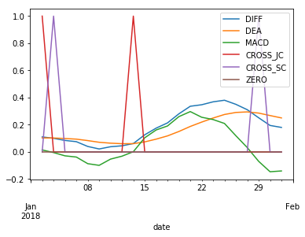
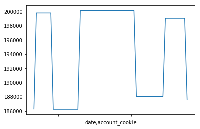
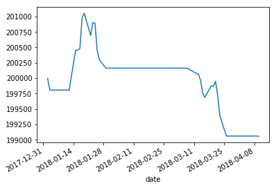
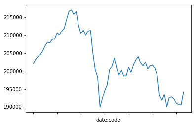
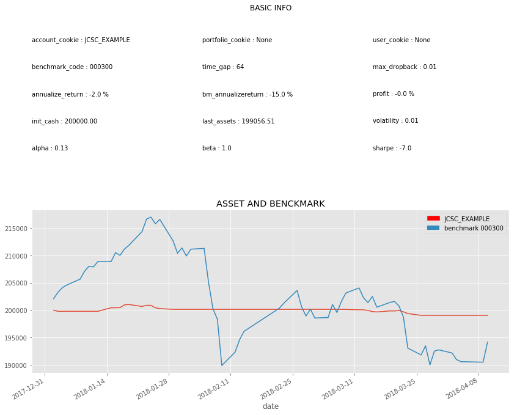
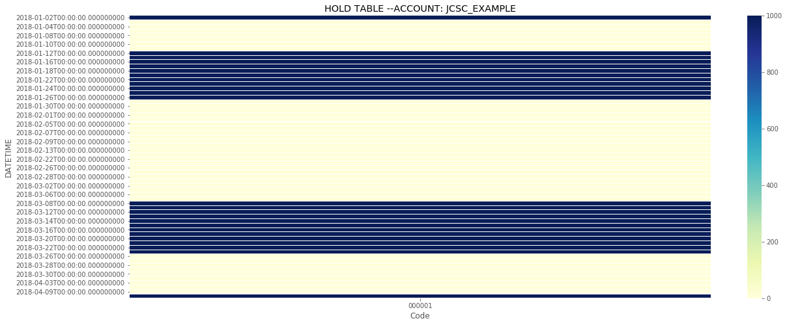
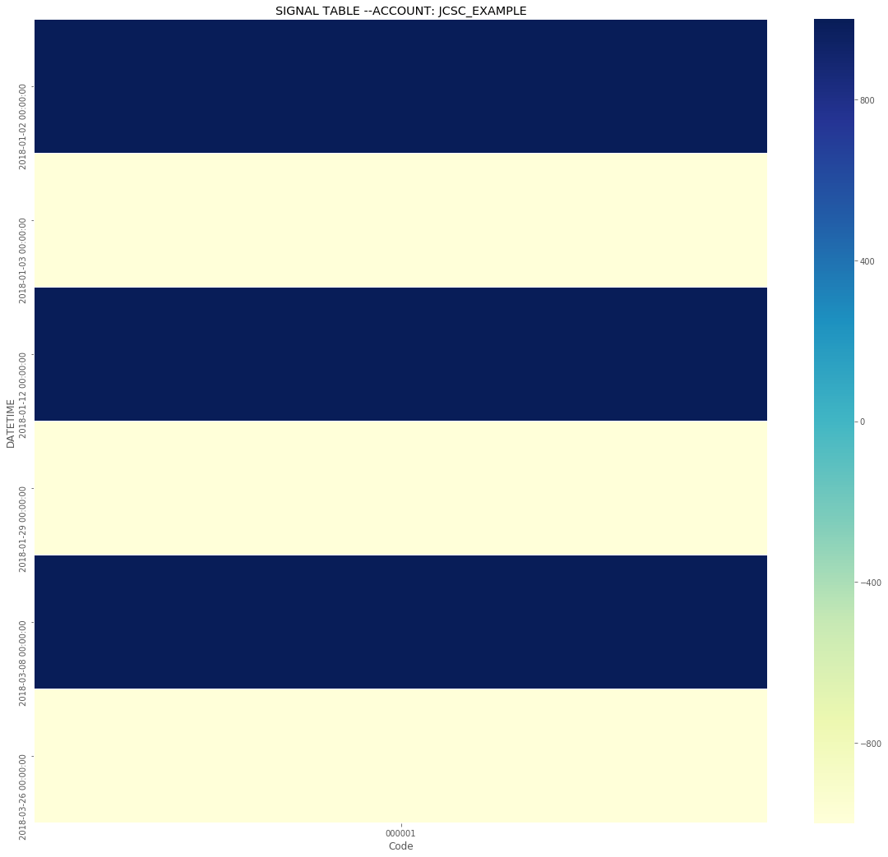
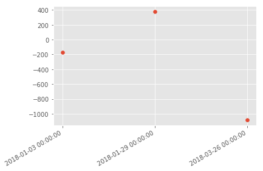

```python
import QUANTAXIS as QA
try:
    assert QA.__version__>='1.1.0'
except AssertionError:
    print('pip install QUANTAXIS >= 1.1.0 请升级QUANTAXIS后再运行此示例')
```


```python
print('首先确定你已经完成了对于QUANTAXIS的基础认知,以及在本地存储完毕了QUANTAXIS的数据库')
```

    首先确定你已经完成了对于QUANTAXIS的基础认知,以及在本地存储完毕了QUANTAXIS的数据库
    

# QUANTAXIS 回测的一些基础知识

##  QA回测的核心是两个类

```
QA_BacktestBroker
QA_Account
```

##  回测数据的引入/迭代

```
QA.QA_fetch_stock_day_adv
QA.QA_fetch_stock_min_adv
```

##  指标的计算

```
DataStruct.add_func
```

##  对于账户的灵活运用

```
QA_Account
QA_Risk
QA_Portfolio
QA_PortfolioView
QA_User
```

## STEP1 初始化账户,初始化回测broker


```python
Account=QA.QA_Account()
Broker=QA.QA_BacktestBroker()
```


```python
import warnings
```


```python
# # 打印账户的信息
# try:
#     from pprint import  pprint as print
# except:
#     pass
# print(Account.message)
```

## 首先讲解Account类:

QA_Account在初始化的时候,可以自己指定很多信息:

```

    QA_Account(
        strategy_name=None, user_cookie=None, portfolio_cookie=None, account_cookie=None,
        market_type=MARKET_TYPE.STOCK_CN, frequence=FREQUENCE.DAY, broker=BROKER_TYPE.BACKETEST,
        init_hold={}, init_cash=1000000, commission_coeff=0.00025, tax_coeff=0.0015,
        margin_level=False, allow_t0=False, allow_sellopen=False,
        running_environment=RUNNING_ENVIRONMENT.BACKETEST)

        :param [str] strategy_name:  策略名称
        :param [str] user_cookie:   用户cookie
        :param [str] portfolio_cookie: 组合cookie
        :param [str] account_cookie:   账户cookie

        :param [dict] init_hold         初始化时的股票资产
        :param [float] init_cash:         初始化资金
        :param [float] commission_coeff:  交易佣金 :默认 万2.5   float 类型
        :param [float] tax_coeff:         印花税   :默认 千1.5   float 类型

        :param [Bool] margin_level:      保证金比例 默认False
        :param [Bool] allow_t0:          是否允许t+0交易  默认False
        :param [Bool] allow_sellopen:    是否允许卖空开仓  默认False

        :param [QA.PARAM] market_type:   市场类别 默认QA.MARKET_TYPE.STOCK_CN A股股票
        :param [QA.PARAM] frequence:     账户级别 默认日线QA.FREQUENCE.DAY
        :param [QA.PARAM] broker:        BROEKR类 默认回测 QA.BROKER_TYPE.BACKTEST
        :param [QA.PARAM] running_environment 当前运行环境 默认Backtest

        # 2018/06/11 init_assets 从float变为dict,并且不作为输入,作为只读属性
        #  :param [float] init_assets:       初始资产  默认 1000000 元 （100万）
        init_assets:{
            cash: xxx,
            stock: {'000001':2000},
            init_date: '2018-02-05',
            init_datetime: '2018-02-05 15:00:00'
        }
        # 2018/06/11 取消在初始化的时候的cash和history输入
        # :param [list] cash:              可用现金  默认 是 初始资产  list 类型
        # :param [list] history:           交易历史
```


```python
# 重设账户初始资金

Account.reset_assets(200000)
Account.account_cookie='JCSC_EXAMPLE'
```


```python
Account.init_assets
```


    {'cash': 200000, 'hold': {}}


Account 有很多方法,暂时不详细展开,我们先直接进入下一步

# SETP2:引入回测的市场数据

引入方法非常简单,直接使用QA_fetch_stock_day_adv系列即可

- code 可以是多种多样的选取方式

```python
1. QA.QA_fetch_stock_list_adv().code.tolist() # 获取全市场的股票代码
2. QA.QA_fetch_stock_block_adv().get_block('云计算').code  # 按版块选取
3. code= ['000001','000002'] # 自己指定
```
- 数据获取后,to_qfq() 即可获得前复权数据

```python
data=DataSturct.to_qfq()
```


```python
# QA.QA_fetch_stock_list_adv().code.tolist()
# QA.QA_fetch_stock_block_adv().get_block('云计算').code
#codelist=QA.QA_fetch_stock_block_adv().get_block('云计算').code
codelist=['000001']
```


```python
data=QA.QA_fetch_stock_day_adv(codelist,'2017-09-01','2018-05-20')
```


```python
data
```


    < QA_DataStruct_Stock_day with 1 securities >


```python
data=data.to_qfq()
```


```python
# data.data
```

## STEP3:计算一些指标

指标的计算可以在回测前,也可以在回测中进行

回测前的计算则是批量计算,效率较高

回测中的计算,效率略低,但代码量较小,易于理解

PS: 指标的相关介绍参见 [QUANTAXIS的指标系统](https://github.com/QUANTAXIS/QUANTAXIS/blob/master/Documents/indicators.md)


```python
import numpy as np
import pandas as pd
def MACD_JCSC(dataframe,SHORT=12,LONG=26,M=9):
    """
    1.DIF向上突破DEA，买入信号参考。
    
    2.DIF向下跌破DEA，卖出信号参考。
    """
    CLOSE=dataframe.close
    DIFF =QA.EMA(CLOSE,SHORT) - QA.EMA(CLOSE,LONG)
    DEA = QA.EMA(DIFF,M)
    MACD =2*(DIFF-DEA)

    CROSS_JC=QA.CROSS(DIFF,DEA)
    CROSS_SC=QA.CROSS(DEA,DIFF)
    ZERO=0
    return pd.DataFrame({'DIFF':DIFF,'DEA':DEA,'MACD':MACD,'CROSS_JC':CROSS_JC,'CROSS_SC':CROSS_SC,'ZERO':ZERO})
```


```python
ind=data.add_func(MACD_JCSC)
```


```python
ind.xs(codelist[0],level=1)['2018-01'].plot()
```


    <matplotlib.axes._subplots.AxesSubplot at 0x1fb23cb9f98>





```python
ind.xs(codelist[0],level=1)['2018-01']
```


<div>
<style scoped>
    .dataframe tbody tr th:only-of-type {
        vertical-align: middle;
    }

    .dataframe tbody tr th {
        vertical-align: top;
    }

    .dataframe thead th {
        text-align: right;
    }
</style>
<table border="1" class="dataframe">
  <thead>
    <tr style="text-align: right;">
      <th></th>
      <th>DIFF</th>
      <th>DEA</th>
      <th>MACD</th>
      <th>CROSS_JC</th>
      <th>CROSS_SC</th>
      <th>ZERO</th>
    </tr>
    <tr>
      <th>date</th>
      <th></th>
      <th></th>
      <th></th>
      <th></th>
      <th></th>
      <th></th>
    </tr>
  </thead>
  <tbody>
    <tr>
      <th>2018-01-02</th>
      <td>0.110686</td>
      <td>0.103225</td>
      <td>0.014921</td>
      <td>1</td>
      <td>0</td>
      <td>0</td>
    </tr>
    <tr>
      <th>2018-01-03</th>
      <td>0.100387</td>
      <td>0.102657</td>
      <td>-0.004541</td>
      <td>0</td>
      <td>1</td>
      <td>0</td>
    </tr>
    <tr>
      <th>2018-01-04</th>
      <td>0.084801</td>
      <td>0.099086</td>
      <td>-0.028570</td>
      <td>0</td>
      <td>0</td>
      <td>0</td>
    </tr>
    <tr>
      <th>2018-01-05</th>
      <td>0.075607</td>
      <td>0.094390</td>
      <td>-0.037566</td>
      <td>0</td>
      <td>0</td>
      <td>0</td>
    </tr>
    <tr>
      <th>2018-01-08</th>
      <td>0.040453</td>
      <td>0.083603</td>
      <td>-0.086299</td>
      <td>0</td>
      <td>0</td>
      <td>0</td>
    </tr>
    <tr>
      <th>2018-01-09</th>
      <td>0.022012</td>
      <td>0.071285</td>
      <td>-0.098545</td>
      <td>0</td>
      <td>0</td>
      <td>0</td>
    </tr>
    <tr>
      <th>2018-01-10</th>
      <td>0.038391</td>
      <td>0.064706</td>
      <td>-0.052629</td>
      <td>0</td>
      <td>0</td>
      <td>0</td>
    </tr>
    <tr>
      <th>2018-01-11</th>
      <td>0.045208</td>
      <td>0.060806</td>
      <td>-0.031197</td>
      <td>0</td>
      <td>0</td>
      <td>0</td>
    </tr>
    <tr>
      <th>2018-01-12</th>
      <td>0.061988</td>
      <td>0.061043</td>
      <td>0.001890</td>
      <td>1</td>
      <td>0</td>
      <td>0</td>
    </tr>
    <tr>
      <th>2018-01-15</th>
      <td>0.126236</td>
      <td>0.074081</td>
      <td>0.104309</td>
      <td>0</td>
      <td>0</td>
      <td>0</td>
    </tr>
    <tr>
      <th>2018-01-16</th>
      <td>0.175134</td>
      <td>0.094292</td>
      <td>0.161683</td>
      <td>0</td>
      <td>0</td>
      <td>0</td>
    </tr>
    <tr>
      <th>2018-01-17</th>
      <td>0.213839</td>
      <td>0.118201</td>
      <td>0.191275</td>
      <td>0</td>
      <td>0</td>
      <td>0</td>
    </tr>
    <tr>
      <th>2018-01-18</th>
      <td>0.280788</td>
      <td>0.150718</td>
      <td>0.260139</td>
      <td>0</td>
      <td>0</td>
      <td>0</td>
    </tr>
    <tr>
      <th>2018-01-19</th>
      <td>0.336418</td>
      <td>0.187858</td>
      <td>0.297119</td>
      <td>0</td>
      <td>0</td>
      <td>0</td>
    </tr>
    <tr>
      <th>2018-01-22</th>
      <td>0.347467</td>
      <td>0.219780</td>
      <td>0.255374</td>
      <td>0</td>
      <td>0</td>
      <td>0</td>
    </tr>
    <tr>
      <th>2018-01-23</th>
      <td>0.368907</td>
      <td>0.249605</td>
      <td>0.238603</td>
      <td>0</td>
      <td>0</td>
      <td>0</td>
    </tr>
    <tr>
      <th>2018-01-24</th>
      <td>0.380702</td>
      <td>0.275825</td>
      <td>0.209755</td>
      <td>0</td>
      <td>0</td>
      <td>0</td>
    </tr>
    <tr>
      <th>2018-01-25</th>
      <td>0.350521</td>
      <td>0.290764</td>
      <td>0.119515</td>
      <td>0</td>
      <td>0</td>
      <td>0</td>
    </tr>
    <tr>
      <th>2018-01-26</th>
      <td>0.310920</td>
      <td>0.294795</td>
      <td>0.032249</td>
      <td>0</td>
      <td>0</td>
      <td>0</td>
    </tr>
    <tr>
      <th>2018-01-29</th>
      <td>0.251630</td>
      <td>0.286162</td>
      <td>-0.069064</td>
      <td>0</td>
      <td>1</td>
      <td>0</td>
    </tr>
    <tr>
      <th>2018-01-30</th>
      <td>0.195134</td>
      <td>0.267957</td>
      <td>-0.145646</td>
      <td>0</td>
      <td>0</td>
      <td>0</td>
    </tr>
    <tr>
      <th>2018-01-31</th>
      <td>0.180544</td>
      <td>0.250474</td>
      <td>-0.139859</td>
      <td>0</td>
      <td>0</td>
      <td>0</td>
    </tr>
  </tbody>
</table>
</div>


```python
ind.loc['2018-01',slice(None)]
```


<div>
<style scoped>
    .dataframe tbody tr th:only-of-type {
        vertical-align: middle;
    }

    .dataframe tbody tr th {
        vertical-align: top;
    }

    .dataframe thead th {
        text-align: right;
    }
</style>
<table border="1" class="dataframe">
  <thead>
    <tr style="text-align: right;">
      <th></th>
      <th></th>
      <th>DIFF</th>
      <th>DEA</th>
      <th>MACD</th>
      <th>CROSS_JC</th>
      <th>CROSS_SC</th>
      <th>ZERO</th>
    </tr>
    <tr>
      <th>date</th>
      <th>code</th>
      <th></th>
      <th></th>
      <th></th>
      <th></th>
      <th></th>
      <th></th>
    </tr>
  </thead>
  <tbody>
    <tr>
      <th>2018-01-02</th>
      <th>000001</th>
      <td>0.110686</td>
      <td>0.103225</td>
      <td>0.014921</td>
      <td>1</td>
      <td>0</td>
      <td>0</td>
    </tr>
    <tr>
      <th>2018-01-03</th>
      <th>000001</th>
      <td>0.100387</td>
      <td>0.102657</td>
      <td>-0.004541</td>
      <td>0</td>
      <td>1</td>
      <td>0</td>
    </tr>
    <tr>
      <th>2018-01-04</th>
      <th>000001</th>
      <td>0.084801</td>
      <td>0.099086</td>
      <td>-0.028570</td>
      <td>0</td>
      <td>0</td>
      <td>0</td>
    </tr>
    <tr>
      <th>2018-01-05</th>
      <th>000001</th>
      <td>0.075607</td>
      <td>0.094390</td>
      <td>-0.037566</td>
      <td>0</td>
      <td>0</td>
      <td>0</td>
    </tr>
    <tr>
      <th>2018-01-08</th>
      <th>000001</th>
      <td>0.040453</td>
      <td>0.083603</td>
      <td>-0.086299</td>
      <td>0</td>
      <td>0</td>
      <td>0</td>
    </tr>
    <tr>
      <th>2018-01-09</th>
      <th>000001</th>
      <td>0.022012</td>
      <td>0.071285</td>
      <td>-0.098545</td>
      <td>0</td>
      <td>0</td>
      <td>0</td>
    </tr>
    <tr>
      <th>2018-01-10</th>
      <th>000001</th>
      <td>0.038391</td>
      <td>0.064706</td>
      <td>-0.052629</td>
      <td>0</td>
      <td>0</td>
      <td>0</td>
    </tr>
    <tr>
      <th>2018-01-11</th>
      <th>000001</th>
      <td>0.045208</td>
      <td>0.060806</td>
      <td>-0.031197</td>
      <td>0</td>
      <td>0</td>
      <td>0</td>
    </tr>
    <tr>
      <th>2018-01-12</th>
      <th>000001</th>
      <td>0.061988</td>
      <td>0.061043</td>
      <td>0.001890</td>
      <td>1</td>
      <td>0</td>
      <td>0</td>
    </tr>
    <tr>
      <th>2018-01-15</th>
      <th>000001</th>
      <td>0.126236</td>
      <td>0.074081</td>
      <td>0.104309</td>
      <td>0</td>
      <td>0</td>
      <td>0</td>
    </tr>
    <tr>
      <th>2018-01-16</th>
      <th>000001</th>
      <td>0.175134</td>
      <td>0.094292</td>
      <td>0.161683</td>
      <td>0</td>
      <td>0</td>
      <td>0</td>
    </tr>
    <tr>
      <th>2018-01-17</th>
      <th>000001</th>
      <td>0.213839</td>
      <td>0.118201</td>
      <td>0.191275</td>
      <td>0</td>
      <td>0</td>
      <td>0</td>
    </tr>
    <tr>
      <th>2018-01-18</th>
      <th>000001</th>
      <td>0.280788</td>
      <td>0.150718</td>
      <td>0.260139</td>
      <td>0</td>
      <td>0</td>
      <td>0</td>
    </tr>
    <tr>
      <th>2018-01-19</th>
      <th>000001</th>
      <td>0.336418</td>
      <td>0.187858</td>
      <td>0.297119</td>
      <td>0</td>
      <td>0</td>
      <td>0</td>
    </tr>
    <tr>
      <th>2018-01-22</th>
      <th>000001</th>
      <td>0.347467</td>
      <td>0.219780</td>
      <td>0.255374</td>
      <td>0</td>
      <td>0</td>
      <td>0</td>
    </tr>
    <tr>
      <th>2018-01-23</th>
      <th>000001</th>
      <td>0.368907</td>
      <td>0.249605</td>
      <td>0.238603</td>
      <td>0</td>
      <td>0</td>
      <td>0</td>
    </tr>
    <tr>
      <th>2018-01-24</th>
      <th>000001</th>
      <td>0.380702</td>
      <td>0.275825</td>
      <td>0.209755</td>
      <td>0</td>
      <td>0</td>
      <td>0</td>
    </tr>
    <tr>
      <th>2018-01-25</th>
      <th>000001</th>
      <td>0.350521</td>
      <td>0.290764</td>
      <td>0.119515</td>
      <td>0</td>
      <td>0</td>
      <td>0</td>
    </tr>
    <tr>
      <th>2018-01-26</th>
      <th>000001</th>
      <td>0.310920</td>
      <td>0.294795</td>
      <td>0.032249</td>
      <td>0</td>
      <td>0</td>
      <td>0</td>
    </tr>
    <tr>
      <th>2018-01-29</th>
      <th>000001</th>
      <td>0.251630</td>
      <td>0.286162</td>
      <td>-0.069064</td>
      <td>0</td>
      <td>1</td>
      <td>0</td>
    </tr>
    <tr>
      <th>2018-01-30</th>
      <th>000001</th>
      <td>0.195134</td>
      <td>0.267957</td>
      <td>-0.145646</td>
      <td>0</td>
      <td>0</td>
      <td>0</td>
    </tr>
    <tr>
      <th>2018-01-31</th>
      <th>000001</th>
      <td>0.180544</td>
      <td>0.250474</td>
      <td>-0.139859</td>
      <td>0</td>
      <td>0</td>
      <td>0</td>
    </tr>
  </tbody>
</table>
</div>


# SETP4:选取回测的开始和结束日期,构建回测


```python
data_forbacktest=data.select_time('2018-01-01','2018-05-01')


for items in data_forbacktest.panel_gen:
    for item in items.security_gen:
        daily_ind=ind.loc[item.index]
        if daily_ind.CROSS_JC.iloc[0]>0:
            order=Account.send_order(
                code=item.code[0], 
                time=item.date[0], 
                amount=1000, 
                towards=QA.ORDER_DIRECTION.BUY, 
                price=0, 
                order_model=QA.ORDER_MODEL.CLOSE, 
                amount_model=QA.AMOUNT_MODEL.BY_AMOUNT
                )
            #print(item.to_json()[0])
            Broker.receive_order(QA.QA_Event(order=order,market_data=item))
            
            
            trade_mes=Broker.query_orders(Account.account_cookie,'filled')
            res=trade_mes.loc[order.account_cookie,order.realorder_id]
            order.trade(res.trade_id,res.trade_price,res.trade_amount,res.trade_time)
        elif daily_ind.CROSS_SC.iloc[0]>0:
            if Account.sell_available.get(item.code[0], 0)>0:
                order=Account.send_order(
                    code=item.code[0], 
                    time=item.date[0], 
                    amount=Account.sell_available.get(item.code[0], 0), 
                    towards=QA.ORDER_DIRECTION.SELL, 
                    price=0, 
                    order_model=QA.ORDER_MODEL.MARKET, 
                    amount_model=QA.AMOUNT_MODEL.BY_AMOUNT
                    )
                Broker.receive_order(QA.QA_Event(order=order,market_data=item))


                trade_mes=Broker.query_orders(Account.account_cookie,'filled')
                res=trade_mes.loc[order.account_cookie,order.realorder_id]
                order.trade(res.trade_id,res.trade_price,res.trade_amount,res.trade_time)
    Account.settle()
            
        #break
```

    receive deal
    receive deal
    receive deal
    receive deal
    receive deal
    receive deal
    receive deal
    

## STEP5: 分析账户


```python
Account.history
```


    [['2018-01-02 00:00:00',
      '000001',
      13.7,
      1000,
      186295.0,
      'Order_FemEzpZ0',
      'Order_FemEzpZ0',
      'Trade_TQzDbd0g',
      'JCSC_EXAMPLE',
      5,
      0,
      None],
     ['2018-01-03 00:00:00',
      '000001',
      13.53,
      -1000,
      199806.47,
      'Order_mnKfLY0M',
      'Order_mnKfLY0M',
      'Trade_ldhSrMYa',
      'JCSC_EXAMPLE',
      5,
      13.530000000000001,
      None],
     ['2018-01-12 00:00:00',
      '000001',
      13.55,
      1000,
      186251.47,
      'Order_nWrOyhV4',
      'Order_nWrOyhV4',
      'Trade_AkSzOM7i',
      'JCSC_EXAMPLE',
      5,
      0,
      None],
     ['2018-01-29 00:00:00',
      '000001',
      13.93,
      -1000,
      200162.54,
      'Order_ygQNXbEJ',
      'Order_ygQNXbEJ',
      'Trade_HW4C7STK',
      'JCSC_EXAMPLE',
      5,
      13.93,
      None],
     ['2018-03-08 00:00:00',
      '000001',
      12.11,
      1000,
      188047.54,
      'Order_osmdlg2w',
      'Order_osmdlg2w',
      'Trade_UpRMLDi9',
      'JCSC_EXAMPLE',
      5,
      0,
      None],
     ['2018-03-26 00:00:00',
      '000001',
      11.03,
      -1000,
      199061.51,
      'Order_07LT6nZE',
      'Order_07LT6nZE',
      'Trade_kQDMnIJH',
      'JCSC_EXAMPLE',
      5,
      11.03,
      None],
     ['2018-04-10 00:00:00',
      '000001',
      11.42,
      1000,
      187636.51,
      'Order_r9Mdl61s',
      'Order_r9Mdl61s',
      'Trade_zA7EdDj0',
      'JCSC_EXAMPLE',
      5,
      0,
      None]]


```python
Account.history_table
```


<div>
<style scoped>
    .dataframe tbody tr th:only-of-type {
        vertical-align: middle;
    }

    .dataframe tbody tr th {
        vertical-align: top;
    }

    .dataframe thead th {
        text-align: right;
    }
</style>
<table border="1" class="dataframe">
  <thead>
    <tr style="text-align: right;">
      <th></th>
      <th>datetime</th>
      <th>code</th>
      <th>price</th>
      <th>amount</th>
      <th>cash</th>
      <th>order_id</th>
      <th>realorder_id</th>
      <th>trade_id</th>
      <th>account_cookie</th>
      <th>commission</th>
      <th>tax</th>
      <th>message</th>
    </tr>
  </thead>
  <tbody>
    <tr>
      <th>0</th>
      <td>2018-01-02 00:00:00</td>
      <td>000001</td>
      <td>13.70</td>
      <td>1000</td>
      <td>186295.00</td>
      <td>Order_FemEzpZ0</td>
      <td>Order_FemEzpZ0</td>
      <td>Trade_TQzDbd0g</td>
      <td>JCSC_EXAMPLE</td>
      <td>5</td>
      <td>0.00</td>
      <td>None</td>
    </tr>
    <tr>
      <th>1</th>
      <td>2018-01-03 00:00:00</td>
      <td>000001</td>
      <td>13.53</td>
      <td>-1000</td>
      <td>199806.47</td>
      <td>Order_mnKfLY0M</td>
      <td>Order_mnKfLY0M</td>
      <td>Trade_ldhSrMYa</td>
      <td>JCSC_EXAMPLE</td>
      <td>5</td>
      <td>13.53</td>
      <td>None</td>
    </tr>
    <tr>
      <th>2</th>
      <td>2018-01-12 00:00:00</td>
      <td>000001</td>
      <td>13.55</td>
      <td>1000</td>
      <td>186251.47</td>
      <td>Order_nWrOyhV4</td>
      <td>Order_nWrOyhV4</td>
      <td>Trade_AkSzOM7i</td>
      <td>JCSC_EXAMPLE</td>
      <td>5</td>
      <td>0.00</td>
      <td>None</td>
    </tr>
    <tr>
      <th>3</th>
      <td>2018-01-29 00:00:00</td>
      <td>000001</td>
      <td>13.93</td>
      <td>-1000</td>
      <td>200162.54</td>
      <td>Order_ygQNXbEJ</td>
      <td>Order_ygQNXbEJ</td>
      <td>Trade_HW4C7STK</td>
      <td>JCSC_EXAMPLE</td>
      <td>5</td>
      <td>13.93</td>
      <td>None</td>
    </tr>
    <tr>
      <th>4</th>
      <td>2018-03-08 00:00:00</td>
      <td>000001</td>
      <td>12.11</td>
      <td>1000</td>
      <td>188047.54</td>
      <td>Order_osmdlg2w</td>
      <td>Order_osmdlg2w</td>
      <td>Trade_UpRMLDi9</td>
      <td>JCSC_EXAMPLE</td>
      <td>5</td>
      <td>0.00</td>
      <td>None</td>
    </tr>
    <tr>
      <th>5</th>
      <td>2018-03-26 00:00:00</td>
      <td>000001</td>
      <td>11.03</td>
      <td>-1000</td>
      <td>199061.51</td>
      <td>Order_07LT6nZE</td>
      <td>Order_07LT6nZE</td>
      <td>Trade_kQDMnIJH</td>
      <td>JCSC_EXAMPLE</td>
      <td>5</td>
      <td>11.03</td>
      <td>None</td>
    </tr>
    <tr>
      <th>6</th>
      <td>2018-04-10 00:00:00</td>
      <td>000001</td>
      <td>11.42</td>
      <td>1000</td>
      <td>187636.51</td>
      <td>Order_r9Mdl61s</td>
      <td>Order_r9Mdl61s</td>
      <td>Trade_zA7EdDj0</td>
      <td>JCSC_EXAMPLE</td>
      <td>5</td>
      <td>0.00</td>
      <td>None</td>
    </tr>
  </tbody>
</table>
</div>


```python
#pd.concat([Account.daily_hold.reset_index().set_index('date'),pd.Series(data=None,index=pd.to_datetime(Account.trade_range).set_names('date'),name='predrop')],axis=1).ffill().drop(['predrop'],axis=1).reset_index()
```


```python
Account.daily_cash.cash.plot()
```


    <matplotlib.axes._subplots.AxesSubplot at 0x1fb242d8c88>





```python
Account.daily_hold
```


<div>
<style scoped>
    .dataframe tbody tr th:only-of-type {
        vertical-align: middle;
    }

    .dataframe tbody tr th {
        vertical-align: top;
    }

    .dataframe thead th {
        text-align: right;
    }
</style>
<table border="1" class="dataframe">
  <thead>
    <tr style="text-align: right;">
      <th></th>
      <th></th>
      <th>000001</th>
    </tr>
    <tr>
      <th>date</th>
      <th>account_cookie</th>
      <th></th>
    </tr>
  </thead>
  <tbody>
    <tr>
      <th>2018-01-02</th>
      <th>JCSC_EXAMPLE</th>
      <td>1000.0</td>
    </tr>
    <tr>
      <th>2018-01-03</th>
      <th>JCSC_EXAMPLE</th>
      <td>0.0</td>
    </tr>
    <tr>
      <th>2018-01-04</th>
      <th>JCSC_EXAMPLE</th>
      <td>0.0</td>
    </tr>
    <tr>
      <th>2018-01-05</th>
      <th>JCSC_EXAMPLE</th>
      <td>0.0</td>
    </tr>
    <tr>
      <th>2018-01-08</th>
      <th>JCSC_EXAMPLE</th>
      <td>0.0</td>
    </tr>
    <tr>
      <th>2018-01-09</th>
      <th>JCSC_EXAMPLE</th>
      <td>0.0</td>
    </tr>
    <tr>
      <th>2018-01-10</th>
      <th>JCSC_EXAMPLE</th>
      <td>0.0</td>
    </tr>
    <tr>
      <th>2018-01-11</th>
      <th>JCSC_EXAMPLE</th>
      <td>0.0</td>
    </tr>
    <tr>
      <th>2018-01-12</th>
      <th>JCSC_EXAMPLE</th>
      <td>1000.0</td>
    </tr>
    <tr>
      <th>2018-01-15</th>
      <th>JCSC_EXAMPLE</th>
      <td>1000.0</td>
    </tr>
    <tr>
      <th>2018-01-16</th>
      <th>JCSC_EXAMPLE</th>
      <td>1000.0</td>
    </tr>
    <tr>
      <th>2018-01-17</th>
      <th>JCSC_EXAMPLE</th>
      <td>1000.0</td>
    </tr>
    <tr>
      <th>2018-01-18</th>
      <th>JCSC_EXAMPLE</th>
      <td>1000.0</td>
    </tr>
    <tr>
      <th>2018-01-19</th>
      <th>JCSC_EXAMPLE</th>
      <td>1000.0</td>
    </tr>
    <tr>
      <th>2018-01-22</th>
      <th>JCSC_EXAMPLE</th>
      <td>1000.0</td>
    </tr>
    <tr>
      <th>2018-01-23</th>
      <th>JCSC_EXAMPLE</th>
      <td>1000.0</td>
    </tr>
    <tr>
      <th>2018-01-24</th>
      <th>JCSC_EXAMPLE</th>
      <td>1000.0</td>
    </tr>
    <tr>
      <th>2018-01-25</th>
      <th>JCSC_EXAMPLE</th>
      <td>1000.0</td>
    </tr>
    <tr>
      <th>2018-01-26</th>
      <th>JCSC_EXAMPLE</th>
      <td>1000.0</td>
    </tr>
    <tr>
      <th>2018-01-29</th>
      <th>JCSC_EXAMPLE</th>
      <td>0.0</td>
    </tr>
    <tr>
      <th>2018-01-30</th>
      <th>JCSC_EXAMPLE</th>
      <td>0.0</td>
    </tr>
    <tr>
      <th>2018-01-31</th>
      <th>JCSC_EXAMPLE</th>
      <td>0.0</td>
    </tr>
    <tr>
      <th>2018-02-01</th>
      <th>JCSC_EXAMPLE</th>
      <td>0.0</td>
    </tr>
    <tr>
      <th>2018-02-02</th>
      <th>JCSC_EXAMPLE</th>
      <td>0.0</td>
    </tr>
    <tr>
      <th>2018-02-05</th>
      <th>JCSC_EXAMPLE</th>
      <td>0.0</td>
    </tr>
    <tr>
      <th>2018-02-06</th>
      <th>JCSC_EXAMPLE</th>
      <td>0.0</td>
    </tr>
    <tr>
      <th>2018-02-07</th>
      <th>JCSC_EXAMPLE</th>
      <td>0.0</td>
    </tr>
    <tr>
      <th>2018-02-08</th>
      <th>JCSC_EXAMPLE</th>
      <td>0.0</td>
    </tr>
    <tr>
      <th>2018-02-09</th>
      <th>JCSC_EXAMPLE</th>
      <td>0.0</td>
    </tr>
    <tr>
      <th>2018-02-12</th>
      <th>JCSC_EXAMPLE</th>
      <td>0.0</td>
    </tr>
    <tr>
      <th>...</th>
      <th>...</th>
      <td>...</td>
    </tr>
    <tr>
      <th>2018-02-26</th>
      <th>JCSC_EXAMPLE</th>
      <td>0.0</td>
    </tr>
    <tr>
      <th>2018-02-27</th>
      <th>JCSC_EXAMPLE</th>
      <td>0.0</td>
    </tr>
    <tr>
      <th>2018-02-28</th>
      <th>JCSC_EXAMPLE</th>
      <td>0.0</td>
    </tr>
    <tr>
      <th>2018-03-01</th>
      <th>JCSC_EXAMPLE</th>
      <td>0.0</td>
    </tr>
    <tr>
      <th>2018-03-02</th>
      <th>JCSC_EXAMPLE</th>
      <td>0.0</td>
    </tr>
    <tr>
      <th>2018-03-05</th>
      <th>JCSC_EXAMPLE</th>
      <td>0.0</td>
    </tr>
    <tr>
      <th>2018-03-06</th>
      <th>JCSC_EXAMPLE</th>
      <td>0.0</td>
    </tr>
    <tr>
      <th>2018-03-07</th>
      <th>JCSC_EXAMPLE</th>
      <td>0.0</td>
    </tr>
    <tr>
      <th>2018-03-08</th>
      <th>JCSC_EXAMPLE</th>
      <td>1000.0</td>
    </tr>
    <tr>
      <th>2018-03-09</th>
      <th>JCSC_EXAMPLE</th>
      <td>1000.0</td>
    </tr>
    <tr>
      <th>2018-03-12</th>
      <th>JCSC_EXAMPLE</th>
      <td>1000.0</td>
    </tr>
    <tr>
      <th>2018-03-13</th>
      <th>JCSC_EXAMPLE</th>
      <td>1000.0</td>
    </tr>
    <tr>
      <th>2018-03-14</th>
      <th>JCSC_EXAMPLE</th>
      <td>1000.0</td>
    </tr>
    <tr>
      <th>2018-03-15</th>
      <th>JCSC_EXAMPLE</th>
      <td>1000.0</td>
    </tr>
    <tr>
      <th>2018-03-16</th>
      <th>JCSC_EXAMPLE</th>
      <td>1000.0</td>
    </tr>
    <tr>
      <th>2018-03-19</th>
      <th>JCSC_EXAMPLE</th>
      <td>1000.0</td>
    </tr>
    <tr>
      <th>2018-03-20</th>
      <th>JCSC_EXAMPLE</th>
      <td>1000.0</td>
    </tr>
    <tr>
      <th>2018-03-21</th>
      <th>JCSC_EXAMPLE</th>
      <td>1000.0</td>
    </tr>
    <tr>
      <th>2018-03-22</th>
      <th>JCSC_EXAMPLE</th>
      <td>1000.0</td>
    </tr>
    <tr>
      <th>2018-03-23</th>
      <th>JCSC_EXAMPLE</th>
      <td>1000.0</td>
    </tr>
    <tr>
      <th>2018-03-26</th>
      <th>JCSC_EXAMPLE</th>
      <td>0.0</td>
    </tr>
    <tr>
      <th>2018-03-27</th>
      <th>JCSC_EXAMPLE</th>
      <td>0.0</td>
    </tr>
    <tr>
      <th>2018-03-28</th>
      <th>JCSC_EXAMPLE</th>
      <td>0.0</td>
    </tr>
    <tr>
      <th>2018-03-29</th>
      <th>JCSC_EXAMPLE</th>
      <td>0.0</td>
    </tr>
    <tr>
      <th>2018-03-30</th>
      <th>JCSC_EXAMPLE</th>
      <td>0.0</td>
    </tr>
    <tr>
      <th>2018-04-02</th>
      <th>JCSC_EXAMPLE</th>
      <td>0.0</td>
    </tr>
    <tr>
      <th>2018-04-03</th>
      <th>JCSC_EXAMPLE</th>
      <td>0.0</td>
    </tr>
    <tr>
      <th>2018-04-04</th>
      <th>JCSC_EXAMPLE</th>
      <td>0.0</td>
    </tr>
    <tr>
      <th>2018-04-09</th>
      <th>JCSC_EXAMPLE</th>
      <td>0.0</td>
    </tr>
    <tr>
      <th>2018-04-10</th>
      <th>JCSC_EXAMPLE</th>
      <td>1000.0</td>
    </tr>
  </tbody>
</table>
<p>64 rows × 1 columns</p>
</div>


```python
Risk=QA.QA_Risk(Account)
```


```python
Risk.message
```


    {'account_cookie': 'JCSC_EXAMPLE',
     'portfolio_cookie': None,
     'user_cookie': None,
     'annualize_return': -0.02,
     'profit': -0.0,
     'max_dropback': 0.01,
     'time_gap': 64,
     'volatility': 0.01,
     'benchmark_code': '000300',
     'bm_annualizereturn': -0.15,
     'bm_profit': -0.03,
     'beta': 1.0,
     'alpha': 0.13,
     'sharpe': -7.0,
     'init_cash': '200000.00',
     'last_assets': '199056.51',
     'total_tax': -38.49,
     'total_commission': -35.0,
     'profit_money': -943.49,
     'assets': [199995.0,
      199806.47,
      199806.47,
      199806.47,
      199806.47,
      199806.47,
      199806.47,
      199806.47,
      199801.47,
      200451.47,
      200451.47,
      200481.47,
      200971.47,
      201051.47,
      200691.47,
      200901.47,
      200891.47,
      200451.47,
      200301.47,
      200162.54,
      200162.54,
      200162.54,
      200162.54,
      200162.54,
      200162.54,
      200162.54,
      200162.54,
      200162.54,
      200162.54,
      200162.54,
      200162.54,
      200162.54,
      200162.54,
      200162.54,
      200162.54,
      200162.54,
      200162.54,
      200162.54,
      200162.54,
      200162.54,
      200162.54,
      200162.54,
      200157.54,
      200137.54,
      200077.54,
      200067.54,
      199967.54,
      199757.54,
      199687.54,
      199877.54,
      199867.54,
      199947.54,
      199707.54,
      199387.54,
      199061.51,
      199061.51,
      199061.51,
      199061.51,
      199061.51,
      199061.51,
      199061.51,
      199061.51,
      199061.51,
      199056.51],
     'benchmark_assets': [202085.92384573357,
      203272.01801636998,
      204133.28356253446,
      204624.72900047217,
      205683.26489848486,
      207123.98120245922,
      208039.13764674764,
      207929.37820286216,
      208889.03171899606,
      208900.89760482148,
      210543.82837973803,
      210032.11205351513,
      211184.09180240333,
      211875.27965173626,
      214406.66862783392,
      216681.45782295603,
      217041.38969299494,
      215814.7537457882,
      216616.6898628254,
      212696.99224514925,
      210426.65275721162,
      211405.58833781187,
      209922.35260962966,
      211174.69797612482,
      211319.06625366793,
      205126.0626765978,
      200261.54390006946,
      198360.53010844925,
      189886.30998143484,
      192331.17687338853,
      194582.23429685974,
      196131.22680899137,
      200371.79775586433,
      201279.53802151186,
      203619.58958867402,
      200680.80519923565,
      198933.55351143697,
      200191.83182084493,
      198578.56576049206,
      198659.64931363266,
      201055.56942655632,
      199576.78340555867,
      201601.4001745274,
      203147.42621520266,
      204076.92060486352,
      202276.2724308503,
      201390.78070112554,
      202519.02867836278,
      200554.23575043076,
      201435.7721848804,
      201606.34429362134,
      200783.1484644802,
      198770.89199324633,
      193064.88414692934,
      191826.38231389716,
      193476.7292674546,
      189988.6532466794,
      192526.4695775992,
      192746.48287727954,
      192173.95388620123,
      190965.61117964212,
      190588.86930468382,
      190493.44780617073,
      194163.96182151238],
     'timeindex': ['2018-01-02',
      '2018-01-03',
      '2018-01-12',
      '2018-01-29',
      '2018-03-08',
      '2018-03-26',
      '2018-04-10'],
     'totaltimeindex': ['2018-01-02',
      '2018-01-03',
      '2018-01-04',
      '2018-01-05',
      '2018-01-08',
      '2018-01-09',
      '2018-01-10',
      '2018-01-11',
      '2018-01-12',
      '2018-01-15',
      '2018-01-16',
      '2018-01-17',
      '2018-01-18',
      '2018-01-19',
      '2018-01-22',
      '2018-01-23',
      '2018-01-24',
      '2018-01-25',
      '2018-01-26',
      '2018-01-29',
      '2018-01-30',
      '2018-01-31',
      '2018-02-01',
      '2018-02-02',
      '2018-02-05',
      '2018-02-06',
      '2018-02-07',
      '2018-02-08',
      '2018-02-09',
      '2018-02-12',
      '2018-02-13',
      '2018-02-14',
      '2018-02-22',
      '2018-02-23',
      '2018-02-26',
      '2018-02-27',
      '2018-02-28',
      '2018-03-01',
      '2018-03-02',
      '2018-03-05',
      '2018-03-06',
      '2018-03-07',
      '2018-03-08',
      '2018-03-09',
      '2018-03-12',
      '2018-03-13',
      '2018-03-14',
      '2018-03-15',
      '2018-03-16',
      '2018-03-19',
      '2018-03-20',
      '2018-03-21',
      '2018-03-22',
      '2018-03-23',
      '2018-03-26',
      '2018-03-27',
      '2018-03-28',
      '2018-03-29',
      '2018-03-30',
      '2018-04-02',
      '2018-04-03',
      '2018-04-04',
      '2018-04-09',
      '2018-04-10'],
     'ir': -2.0}


```python
Risk.market_value.diff().iloc[-1]
```


    code
    000001    11420.0
    Name: (2018-04-10 00:00:00, JCSC_EXAMPLE), dtype: float64


```python
Risk.account.cash_table
```


<div>
<style scoped>
    .dataframe tbody tr th:only-of-type {
        vertical-align: middle;
    }

    .dataframe tbody tr th {
        vertical-align: top;
    }

    .dataframe thead th {
        text-align: right;
    }
</style>
<table border="1" class="dataframe">
  <thead>
    <tr style="text-align: right;">
      <th></th>
      <th></th>
      <th>cash</th>
      <th>datetime</th>
      <th>date</th>
      <th>account_cookie</th>
    </tr>
    <tr>
      <th>datetime</th>
      <th>account_cookie</th>
      <th></th>
      <th></th>
      <th></th>
      <th></th>
    </tr>
  </thead>
  <tbody>
    <tr>
      <th>2018-01-02 00:00:00</th>
      <th>JCSC_EXAMPLE</th>
      <td>186295</td>
      <td>2018-01-02 00:00:00</td>
      <td>2018-01-02</td>
      <td>JCSC_EXAMPLE</td>
    </tr>
    <tr>
      <th>2018-01-03 00:00:00</th>
      <th>JCSC_EXAMPLE</th>
      <td>199806</td>
      <td>2018-01-03 00:00:00</td>
      <td>2018-01-03</td>
      <td>JCSC_EXAMPLE</td>
    </tr>
    <tr>
      <th>2018-01-12 00:00:00</th>
      <th>JCSC_EXAMPLE</th>
      <td>186251</td>
      <td>2018-01-12 00:00:00</td>
      <td>2018-01-12</td>
      <td>JCSC_EXAMPLE</td>
    </tr>
    <tr>
      <th>2018-01-29 00:00:00</th>
      <th>JCSC_EXAMPLE</th>
      <td>200163</td>
      <td>2018-01-29 00:00:00</td>
      <td>2018-01-29</td>
      <td>JCSC_EXAMPLE</td>
    </tr>
    <tr>
      <th>2018-03-08 00:00:00</th>
      <th>JCSC_EXAMPLE</th>
      <td>188048</td>
      <td>2018-03-08 00:00:00</td>
      <td>2018-03-08</td>
      <td>JCSC_EXAMPLE</td>
    </tr>
    <tr>
      <th>2018-03-26 00:00:00</th>
      <th>JCSC_EXAMPLE</th>
      <td>199062</td>
      <td>2018-03-26 00:00:00</td>
      <td>2018-03-26</td>
      <td>JCSC_EXAMPLE</td>
    </tr>
    <tr>
      <th>2018-04-10 00:00:00</th>
      <th>JCSC_EXAMPLE</th>
      <td>187637</td>
      <td>2018-04-10 00:00:00</td>
      <td>2018-04-10</td>
      <td>JCSC_EXAMPLE</td>
    </tr>
  </tbody>
</table>
</div>


```python
z=Account.cash_table.drop_duplicates(subset='date', keep='last').set_index(['date', 'account_cookie'], drop=False)
```


```python
res=Account.cash_table.drop_duplicates(subset='date', keep='last')

zx=pd.concat([res.set_index('date'),pd.Series(data=None,index=pd.to_datetime(Account.trade_range),name='predrop')],axis=1).ffill().drop(['predrop'],axis=1)

```


```python
zxx=pd.to_datetime(Account.trade_range)
```


```python
zxx.set_names('date')
```


    DatetimeIndex(['2018-01-02', '2018-01-03', '2018-01-04', '2018-01-05',
                   '2018-01-08', '2018-01-09', '2018-01-10', '2018-01-11',
                   '2018-01-12', '2018-01-15', '2018-01-16', '2018-01-17',
                   '2018-01-18', '2018-01-19', '2018-01-22', '2018-01-23',
                   '2018-01-24', '2018-01-25', '2018-01-26', '2018-01-29',
                   '2018-01-30', '2018-01-31', '2018-02-01', '2018-02-02',
                   '2018-02-05', '2018-02-06', '2018-02-07', '2018-02-08',
                   '2018-02-09', '2018-02-12', '2018-02-13', '2018-02-14',
                   '2018-02-22', '2018-02-23', '2018-02-26', '2018-02-27',
                   '2018-02-28', '2018-03-01', '2018-03-02', '2018-03-05',
                   '2018-03-06', '2018-03-07', '2018-03-08', '2018-03-09',
                   '2018-03-12', '2018-03-13', '2018-03-14', '2018-03-15',
                   '2018-03-16', '2018-03-19', '2018-03-20', '2018-03-21',
                   '2018-03-22', '2018-03-23', '2018-03-26', '2018-03-27',
                   '2018-03-28', '2018-03-29', '2018-03-30', '2018-04-02',
                   '2018-04-03', '2018-04-04', '2018-04-09', '2018-04-10'],
                  dtype='datetime64[ns]', name='date', freq=None)


```python
Account.daily_hold.index.levels[0]
```


    DatetimeIndex(['2018-01-02', '2018-01-03', '2018-01-04', '2018-01-05',
                   '2018-01-08', '2018-01-09', '2018-01-10', '2018-01-11',
                   '2018-01-12', '2018-01-15', '2018-01-16', '2018-01-17',
                   '2018-01-18', '2018-01-19', '2018-01-22', '2018-01-23',
                   '2018-01-24', '2018-01-25', '2018-01-26', '2018-01-29',
                   '2018-01-30', '2018-01-31', '2018-02-01', '2018-02-02',
                   '2018-02-05', '2018-02-06', '2018-02-07', '2018-02-08',
                   '2018-02-09', '2018-02-12', '2018-02-13', '2018-02-14',
                   '2018-02-22', '2018-02-23', '2018-02-26', '2018-02-27',
                   '2018-02-28', '2018-03-01', '2018-03-02', '2018-03-05',
                   '2018-03-06', '2018-03-07', '2018-03-08', '2018-03-09',
                   '2018-03-12', '2018-03-13', '2018-03-14', '2018-03-15',
                   '2018-03-16', '2018-03-19', '2018-03-20', '2018-03-21',
                   '2018-03-22', '2018-03-23', '2018-03-26', '2018-03-27',
                   '2018-03-28', '2018-03-29', '2018-03-30', '2018-04-02',
                   '2018-04-03', '2018-04-04', '2018-04-09', '2018-04-10'],
                  dtype='datetime64[ns]', name='date', freq=None)


```python
#pd.Series(data=None,index=Account.trade_range,name='date')
```


```python
Risk.market_value.sum(axis=1)
```


    date        account_cookie
    2018-01-02  JCSC_EXAMPLE      13700.0
    2018-01-03  JCSC_EXAMPLE          0.0
    2018-01-04  JCSC_EXAMPLE          0.0
    2018-01-05  JCSC_EXAMPLE          0.0
    2018-01-08  JCSC_EXAMPLE          0.0
    2018-01-09  JCSC_EXAMPLE          0.0
    2018-01-10  JCSC_EXAMPLE          0.0
    2018-01-11  JCSC_EXAMPLE          0.0
    2018-01-12  JCSC_EXAMPLE      13550.0
    2018-01-15  JCSC_EXAMPLE      14200.0
    2018-01-16  JCSC_EXAMPLE      14200.0
    2018-01-17  JCSC_EXAMPLE      14230.0
    2018-01-18  JCSC_EXAMPLE      14720.0
    2018-01-19  JCSC_EXAMPLE      14800.0
    2018-01-22  JCSC_EXAMPLE      14440.0
    2018-01-23  JCSC_EXAMPLE      14650.0
    2018-01-24  JCSC_EXAMPLE      14640.0
    2018-01-25  JCSC_EXAMPLE      14200.0
    2018-01-26  JCSC_EXAMPLE      14050.0
    2018-01-29  JCSC_EXAMPLE          0.0
    2018-01-30  JCSC_EXAMPLE          0.0
    2018-01-31  JCSC_EXAMPLE          0.0
    2018-02-01  JCSC_EXAMPLE          0.0
    2018-02-02  JCSC_EXAMPLE          0.0
    2018-02-05  JCSC_EXAMPLE          0.0
    2018-02-06  JCSC_EXAMPLE          0.0
    2018-02-07  JCSC_EXAMPLE          0.0
    2018-02-08  JCSC_EXAMPLE          0.0
    2018-02-09  JCSC_EXAMPLE          0.0
    2018-02-12  JCSC_EXAMPLE          0.0
                                   ...   
    2018-02-26  JCSC_EXAMPLE          0.0
    2018-02-27  JCSC_EXAMPLE          0.0
    2018-02-28  JCSC_EXAMPLE          0.0
    2018-03-01  JCSC_EXAMPLE          0.0
    2018-03-02  JCSC_EXAMPLE          0.0
    2018-03-05  JCSC_EXAMPLE          0.0
    2018-03-06  JCSC_EXAMPLE          0.0
    2018-03-07  JCSC_EXAMPLE          0.0
    2018-03-08  JCSC_EXAMPLE      12110.0
    2018-03-09  JCSC_EXAMPLE      12090.0
    2018-03-12  JCSC_EXAMPLE      12030.0
    2018-03-13  JCSC_EXAMPLE      12020.0
    2018-03-14  JCSC_EXAMPLE      11920.0
    2018-03-15  JCSC_EXAMPLE      11710.0
    2018-03-16  JCSC_EXAMPLE      11640.0
    2018-03-19  JCSC_EXAMPLE      11830.0
    2018-03-20  JCSC_EXAMPLE      11820.0
    2018-03-21  JCSC_EXAMPLE      11900.0
    2018-03-22  JCSC_EXAMPLE      11660.0
    2018-03-23  JCSC_EXAMPLE      11340.0
    2018-03-26  JCSC_EXAMPLE          0.0
    2018-03-27  JCSC_EXAMPLE          0.0
    2018-03-28  JCSC_EXAMPLE          0.0
    2018-03-29  JCSC_EXAMPLE          0.0
    2018-03-30  JCSC_EXAMPLE          0.0
    2018-04-02  JCSC_EXAMPLE          0.0
    2018-04-03  JCSC_EXAMPLE          0.0
    2018-04-04  JCSC_EXAMPLE          0.0
    2018-04-09  JCSC_EXAMPLE          0.0
    2018-04-10  JCSC_EXAMPLE      11420.0
    Length: 64, dtype: float64


```python
Account.history_table
```


<div>
<style scoped>
    .dataframe tbody tr th:only-of-type {
        vertical-align: middle;
    }

    .dataframe tbody tr th {
        vertical-align: top;
    }

    .dataframe thead th {
        text-align: right;
    }
</style>
<table border="1" class="dataframe">
  <thead>
    <tr style="text-align: right;">
      <th></th>
      <th>datetime</th>
      <th>code</th>
      <th>price</th>
      <th>amount</th>
      <th>cash</th>
      <th>order_id</th>
      <th>realorder_id</th>
      <th>trade_id</th>
      <th>account_cookie</th>
      <th>commission</th>
      <th>tax</th>
      <th>message</th>
    </tr>
  </thead>
  <tbody>
    <tr>
      <th>0</th>
      <td>2018-01-02 00:00:00</td>
      <td>000001</td>
      <td>13.70</td>
      <td>1000</td>
      <td>186295.00</td>
      <td>Order_FemEzpZ0</td>
      <td>Order_FemEzpZ0</td>
      <td>Trade_TQzDbd0g</td>
      <td>JCSC_EXAMPLE</td>
      <td>5</td>
      <td>0.00</td>
      <td>None</td>
    </tr>
    <tr>
      <th>1</th>
      <td>2018-01-03 00:00:00</td>
      <td>000001</td>
      <td>13.53</td>
      <td>-1000</td>
      <td>199806.47</td>
      <td>Order_mnKfLY0M</td>
      <td>Order_mnKfLY0M</td>
      <td>Trade_ldhSrMYa</td>
      <td>JCSC_EXAMPLE</td>
      <td>5</td>
      <td>13.53</td>
      <td>None</td>
    </tr>
    <tr>
      <th>2</th>
      <td>2018-01-12 00:00:00</td>
      <td>000001</td>
      <td>13.55</td>
      <td>1000</td>
      <td>186251.47</td>
      <td>Order_nWrOyhV4</td>
      <td>Order_nWrOyhV4</td>
      <td>Trade_AkSzOM7i</td>
      <td>JCSC_EXAMPLE</td>
      <td>5</td>
      <td>0.00</td>
      <td>None</td>
    </tr>
    <tr>
      <th>3</th>
      <td>2018-01-29 00:00:00</td>
      <td>000001</td>
      <td>13.93</td>
      <td>-1000</td>
      <td>200162.54</td>
      <td>Order_ygQNXbEJ</td>
      <td>Order_ygQNXbEJ</td>
      <td>Trade_HW4C7STK</td>
      <td>JCSC_EXAMPLE</td>
      <td>5</td>
      <td>13.93</td>
      <td>None</td>
    </tr>
    <tr>
      <th>4</th>
      <td>2018-03-08 00:00:00</td>
      <td>000001</td>
      <td>12.11</td>
      <td>1000</td>
      <td>188047.54</td>
      <td>Order_osmdlg2w</td>
      <td>Order_osmdlg2w</td>
      <td>Trade_UpRMLDi9</td>
      <td>JCSC_EXAMPLE</td>
      <td>5</td>
      <td>0.00</td>
      <td>None</td>
    </tr>
    <tr>
      <th>5</th>
      <td>2018-03-26 00:00:00</td>
      <td>000001</td>
      <td>11.03</td>
      <td>-1000</td>
      <td>199061.51</td>
      <td>Order_07LT6nZE</td>
      <td>Order_07LT6nZE</td>
      <td>Trade_kQDMnIJH</td>
      <td>JCSC_EXAMPLE</td>
      <td>5</td>
      <td>11.03</td>
      <td>None</td>
    </tr>
    <tr>
      <th>6</th>
      <td>2018-04-10 00:00:00</td>
      <td>000001</td>
      <td>11.42</td>
      <td>1000</td>
      <td>187636.51</td>
      <td>Order_r9Mdl61s</td>
      <td>Order_r9Mdl61s</td>
      <td>Trade_zA7EdDj0</td>
      <td>JCSC_EXAMPLE</td>
      <td>5</td>
      <td>0.00</td>
      <td>None</td>
    </tr>
  </tbody>
</table>
</div>


```python
Account.cash_table
```


<div>
<style scoped>
    .dataframe tbody tr th:only-of-type {
        vertical-align: middle;
    }

    .dataframe tbody tr th {
        vertical-align: top;
    }

    .dataframe thead th {
        text-align: right;
    }
</style>
<table border="1" class="dataframe">
  <thead>
    <tr style="text-align: right;">
      <th></th>
      <th></th>
      <th>cash</th>
      <th>datetime</th>
      <th>date</th>
      <th>account_cookie</th>
    </tr>
    <tr>
      <th>datetime</th>
      <th>account_cookie</th>
      <th></th>
      <th></th>
      <th></th>
      <th></th>
    </tr>
  </thead>
  <tbody>
    <tr>
      <th>2018-01-02 00:00:00</th>
      <th>JCSC_EXAMPLE</th>
      <td>186295</td>
      <td>2018-01-02 00:00:00</td>
      <td>2018-01-02</td>
      <td>JCSC_EXAMPLE</td>
    </tr>
    <tr>
      <th>2018-01-03 00:00:00</th>
      <th>JCSC_EXAMPLE</th>
      <td>199806</td>
      <td>2018-01-03 00:00:00</td>
      <td>2018-01-03</td>
      <td>JCSC_EXAMPLE</td>
    </tr>
    <tr>
      <th>2018-01-12 00:00:00</th>
      <th>JCSC_EXAMPLE</th>
      <td>186251</td>
      <td>2018-01-12 00:00:00</td>
      <td>2018-01-12</td>
      <td>JCSC_EXAMPLE</td>
    </tr>
    <tr>
      <th>2018-01-29 00:00:00</th>
      <th>JCSC_EXAMPLE</th>
      <td>200163</td>
      <td>2018-01-29 00:00:00</td>
      <td>2018-01-29</td>
      <td>JCSC_EXAMPLE</td>
    </tr>
    <tr>
      <th>2018-03-08 00:00:00</th>
      <th>JCSC_EXAMPLE</th>
      <td>188048</td>
      <td>2018-03-08 00:00:00</td>
      <td>2018-03-08</td>
      <td>JCSC_EXAMPLE</td>
    </tr>
    <tr>
      <th>2018-03-26 00:00:00</th>
      <th>JCSC_EXAMPLE</th>
      <td>199062</td>
      <td>2018-03-26 00:00:00</td>
      <td>2018-03-26</td>
      <td>JCSC_EXAMPLE</td>
    </tr>
    <tr>
      <th>2018-04-10 00:00:00</th>
      <th>JCSC_EXAMPLE</th>
      <td>187637</td>
      <td>2018-04-10 00:00:00</td>
      <td>2018-04-10</td>
      <td>JCSC_EXAMPLE</td>
    </tr>
  </tbody>
</table>
</div>


```python
Risk.assets
```


    date
    2018-01-02    199995.00
    2018-01-03    199806.47
    2018-01-04    199806.47
    2018-01-05    199806.47
    2018-01-08    199806.47
    2018-01-09    199806.47
    2018-01-10    199806.47
    2018-01-11    199806.47
    2018-01-12    199801.47
    2018-01-15    200451.47
    2018-01-16    200451.47
    2018-01-17    200481.47
    2018-01-18    200971.47
    2018-01-19    201051.47
    2018-01-22    200691.47
    2018-01-23    200901.47
    2018-01-24    200891.47
    2018-01-25    200451.47
    2018-01-26    200301.47
    2018-01-29    200162.54
    2018-01-30    200162.54
    2018-01-31    200162.54
    2018-02-01    200162.54
    2018-02-02    200162.54
    2018-02-05    200162.54
    2018-02-06    200162.54
    2018-02-07    200162.54
    2018-02-08    200162.54
    2018-02-09    200162.54
    2018-02-12    200162.54
                    ...    
    2018-02-26    200162.54
    2018-02-27    200162.54
    2018-02-28    200162.54
    2018-03-01    200162.54
    2018-03-02    200162.54
    2018-03-05    200162.54
    2018-03-06    200162.54
    2018-03-07    200162.54
    2018-03-08    200157.54
    2018-03-09    200137.54
    2018-03-12    200077.54
    2018-03-13    200067.54
    2018-03-14    199967.54
    2018-03-15    199757.54
    2018-03-16    199687.54
    2018-03-19    199877.54
    2018-03-20    199867.54
    2018-03-21    199947.54
    2018-03-22    199707.54
    2018-03-23    199387.54
    2018-03-26    199061.51
    2018-03-27    199061.51
    2018-03-28    199061.51
    2018-03-29    199061.51
    2018-03-30    199061.51
    2018-04-02    199061.51
    2018-04-03    199061.51
    2018-04-04    199061.51
    2018-04-09    199061.51
    2018-04-10    199056.51
    Name: 0, Length: 64, dtype: float64


```python
Risk.assets.plot()
```


    <matplotlib.axes._subplots.AxesSubplot at 0x1fb25356160>





```python
Risk.benchmark_assets.plot()
```


    <matplotlib.axes._subplots.AxesSubplot at 0x1fb257f74a8>





```python
Risk.plot_assets_curve()
```


    <module 'matplotlib.pyplot' from 'C:\\ProgramData\\Anaconda3\\lib\\site-packages\\matplotlib\\pyplot.py'>





```python
Risk.plot_dailyhold()
```


    <module 'matplotlib.pyplot' from 'C:\\ProgramData\\Anaconda3\\lib\\site-packages\\matplotlib\\pyplot.py'>





```python
Risk.plot_signal()
```


    <module 'matplotlib.pyplot' from 'C:\\ProgramData\\Anaconda3\\lib\\site-packages\\matplotlib\\pyplot.py'>





```python
Risk.profit_construct
```


    {'total_buyandsell': -870.0,
     'total_tax': -38.49,
     'total_commission': -35.0,
     'total_profit': -943.49}


```python
Performance=QA.QA_Performance(Account)
```


```python
Performance.pnl_fifo
```


<div>
<style scoped>
    .dataframe tbody tr th:only-of-type {
        vertical-align: middle;
    }

    .dataframe tbody tr th {
        vertical-align: top;
    }

    .dataframe thead th {
        text-align: right;
    }
</style>
<table border="1" class="dataframe">
  <thead>
    <tr style="text-align: right;">
      <th></th>
      <th>sell_date</th>
      <th>buy_date</th>
      <th>amount</th>
      <th>sell_price</th>
      <th>buy_price</th>
      <th>pnl_ratio</th>
      <th>pnl_money</th>
    </tr>
    <tr>
      <th>code</th>
      <th></th>
      <th></th>
      <th></th>
      <th></th>
      <th></th>
      <th></th>
      <th></th>
    </tr>
  </thead>
  <tbody>
    <tr>
      <th>000001</th>
      <td>2018-01-03</td>
      <td>2018-01-02</td>
      <td>1000</td>
      <td>13.53</td>
      <td>13.70</td>
      <td>-0.012409</td>
      <td>-170.0</td>
    </tr>
    <tr>
      <th>000001</th>
      <td>2018-01-29</td>
      <td>2018-01-12</td>
      <td>1000</td>
      <td>13.93</td>
      <td>13.55</td>
      <td>0.028044</td>
      <td>380.0</td>
    </tr>
    <tr>
      <th>000001</th>
      <td>2018-03-26</td>
      <td>2018-03-08</td>
      <td>1000</td>
      <td>11.03</td>
      <td>12.11</td>
      <td>-0.089182</td>
      <td>-1080.0</td>
    </tr>
  </tbody>
</table>
</div>


```python
Performance.plot_pnlmoney(Performance.pnl_fifo)
```


    <module 'matplotlib.pyplot' from 'C:\\ProgramData\\Anaconda3\\lib\\site-packages\\matplotlib\\pyplot.py'>





## STEP6: 存储结果


```python
Account.save()
Risk.save()
```

## STEP7: 查看存储的结果


```python
account_info=QA.QA_fetch_account({'account_cookie':'JCSC_EXAMPLE'})
```


```python
account=QA.QA_Account().from_message(account_info[0])
```


```python
account
```


    < QA_Account JCSC_EXAMPLE>


