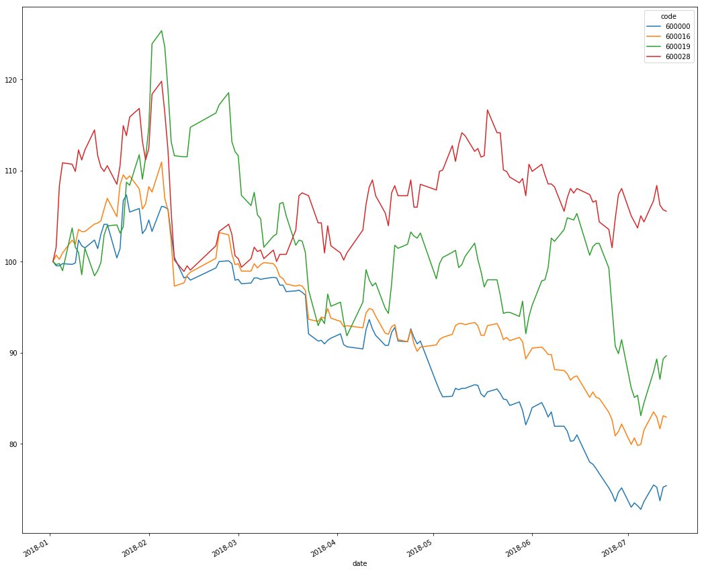
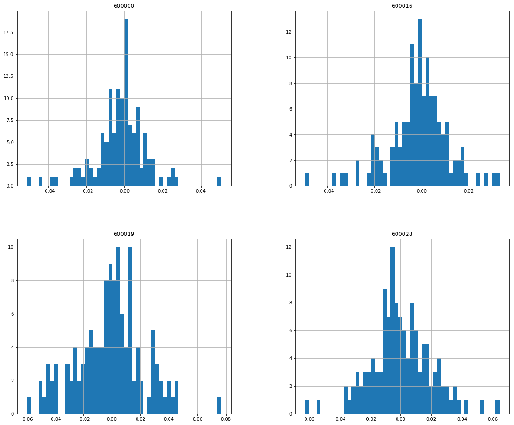
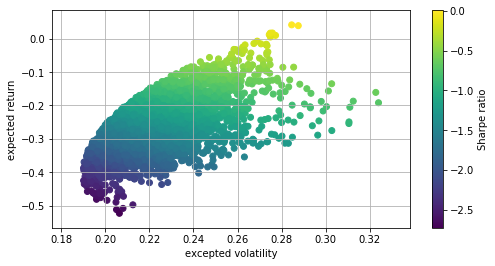
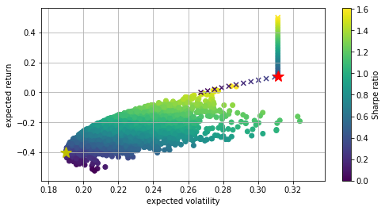

```python
import pandas as pd
import numpy as np
import statsmodels.api as sm
import scipy.stats as scs
import matplotlib.pyplot as plt
import QUANTAXIS as QA
```

    QUANTAXIS>> start QUANTAXIS
    QUANTAXIS>> Welcome to QUANTAXIS, the Version is 1.0.66
    QUANTAXIS>>  
     ```````````````````````````````````````````````````````````````````````````````````````````````````````````````````````` 
      ``########`````##````````##``````````##`````````####````````##```##########````````#``````##``````###```##`````######`` 
      `##``````## ```##````````##`````````####````````##`##```````##```````##```````````###``````##````##`````##```##`````##` 
      ##````````##```##````````##````````##`##````````##``##``````##```````##``````````####```````#```##``````##```##``````## 
      ##````````##```##````````##```````##```##```````##```##`````##```````##`````````##`##```````##`##```````##````##``````` 
      ##````````##```##````````##``````##`````##``````##````##````##```````##````````##``###```````###````````##`````##`````` 
      ##````````##```##````````##``````##``````##`````##`````##```##```````##```````##````##```````###````````##``````###```` 
      ##````````##```##````````##`````##````````##````##``````##``##```````##``````##``````##`````##`##```````##````````##``` 
      ##````````##```##````````##````#############````##```````##`##```````##`````###########`````##``##``````##`````````##`` 
      ###```````##```##````````##```##```````````##```##```````##`##```````##````##`````````##```##```##``````##```##`````##` 
      `##``````###````##``````###``##`````````````##``##````````####```````##```##``````````##``###````##`````##````##`````## 
      ``#########``````########```##``````````````###`##``````````##```````##``##````````````##`##``````##````##`````###``### 
      ````````#####`````````````````````````````````````````````````````````````````````````````````````````````````````##``  
      ``````````````````````````````````````````````````````````````````````````````````````````````````````````````````````` 
      ``````````````````````````Copyright``yutiansut``2018``````QUANTITATIVE FINANCIAL FRAMEWORK````````````````````````````` 
      ``````````````````````````````````````````````````````````````````````````````````````````````````````````````````````` 
     ```````````````````````````````````````````````````````````````````````````````````````````````````````````````````````` 
     ```````````````````````````````````````````````````````````````````````````````````````````````````````````````````````` 
     
    

# 1. 获取股票, 并选取close 进行初步分析


```python
# 获取上证50中的四根票
code=QA.QA_fetch_stock_block_adv().get_block('上证50').code[0:4]
```


```python
data=QA.QA_fetch_stock_day_adv(code,'2018-01-01','2018-07-16').to_qfq()
```


```python

# 选择close序列, 进行pivot成表
close=data.pivot('close')

close.head()
```


<div>
<style scoped>
    .dataframe tbody tr th:only-of-type {
        vertical-align: middle;
    }

    .dataframe tbody tr th {
        vertical-align: top;
    }

    .dataframe thead th {
        text-align: right;
    }
</style>
<table border="1" class="dataframe">
  <thead>
    <tr style="text-align: right;">
      <th>code</th>
      <th>600000</th>
      <th>600016</th>
      <th>600019</th>
      <th>600028</th>
    </tr>
    <tr>
      <th>date</th>
      <th></th>
      <th></th>
      <th></th>
      <th></th>
    </tr>
  </thead>
  <tbody>
    <tr>
      <th>2018-01-02</th>
      <td>12.587085</td>
      <td>7.006029</td>
      <td>8.521262</td>
      <td>6.008582</td>
    </tr>
    <tr>
      <th>2018-01-03</th>
      <td>12.527712</td>
      <td>7.055368</td>
      <td>8.492731</td>
      <td>6.102908</td>
    </tr>
    <tr>
      <th>2018-01-04</th>
      <td>12.527712</td>
      <td>7.022475</td>
      <td>8.502242</td>
      <td>6.508511</td>
    </tr>
    <tr>
      <th>2018-01-05</th>
      <td>12.557398</td>
      <td>7.071814</td>
      <td>8.435669</td>
      <td>6.659433</td>
    </tr>
    <tr>
      <th>2018-01-08</th>
      <td>12.547503</td>
      <td>7.170490</td>
      <td>8.835103</td>
      <td>6.650000</td>
    </tr>
  </tbody>
</table>
</div>


## 使用基准价格比较股票


```python
(close/close.iloc[0]*100).plot(figsize = (18,16))
```


    <matplotlib.axes._subplots.AxesSubplot at 0x2421d172128>





## 计算收益率


```python
log_returns=np.log(close/close.shift(1))
log_returns.head()
```


<div>
<style scoped>
    .dataframe tbody tr th:only-of-type {
        vertical-align: middle;
    }

    .dataframe tbody tr th {
        vertical-align: top;
    }

    .dataframe thead th {
        text-align: right;
    }
</style>
<table border="1" class="dataframe">
  <thead>
    <tr style="text-align: right;">
      <th>code</th>
      <th>600000</th>
      <th>600016</th>
      <th>600019</th>
      <th>600028</th>
    </tr>
    <tr>
      <th>date</th>
      <th></th>
      <th></th>
      <th></th>
      <th></th>
    </tr>
  </thead>
  <tbody>
    <tr>
      <th>2018-01-02</th>
      <td>NaN</td>
      <td>NaN</td>
      <td>NaN</td>
      <td>NaN</td>
    </tr>
    <tr>
      <th>2018-01-03</th>
      <td>-0.004728</td>
      <td>0.007018</td>
      <td>-0.003354</td>
      <td>0.015577</td>
    </tr>
    <tr>
      <th>2018-01-04</th>
      <td>0.000000</td>
      <td>-0.004673</td>
      <td>0.001119</td>
      <td>0.064345</td>
    </tr>
    <tr>
      <th>2018-01-05</th>
      <td>0.002367</td>
      <td>0.007001</td>
      <td>-0.007861</td>
      <td>0.022924</td>
    </tr>
    <tr>
      <th>2018-01-08</th>
      <td>-0.000788</td>
      <td>0.013857</td>
      <td>0.046264</td>
      <td>-0.001417</td>
    </tr>
  </tbody>
</table>
</div>


```python
log_returns.hist(bins = 50, figsize = (19,16))
```


    array([[<matplotlib.axes._subplots.AxesSubplot object at 0x000002421DDCF860>,
            <matplotlib.axes._subplots.AxesSubplot object at 0x000002421DD90630>],
           [<matplotlib.axes._subplots.AxesSubplot object at 0x000002421DDC6588>,
            <matplotlib.axes._subplots.AxesSubplot object at 0x000002421D1802B0>]],
          dtype=object)





```python
log_returns.cov()*252
```


<div>
<style scoped>
    .dataframe tbody tr th:only-of-type {
        vertical-align: middle;
    }

    .dataframe tbody tr th {
        vertical-align: top;
    }

    .dataframe thead th {
        text-align: right;
    }
</style>
<table border="1" class="dataframe">
  <thead>
    <tr style="text-align: right;">
      <th>code</th>
      <th>600000</th>
      <th>600016</th>
      <th>600019</th>
      <th>600028</th>
    </tr>
    <tr>
      <th>code</th>
      <th></th>
      <th></th>
      <th></th>
      <th></th>
    </tr>
  </thead>
  <tbody>
    <tr>
      <th>600000</th>
      <td>0.046201</td>
      <td>0.030160</td>
      <td>0.037957</td>
      <td>0.028727</td>
    </tr>
    <tr>
      <th>600016</th>
      <td>0.030160</td>
      <td>0.040633</td>
      <td>0.036671</td>
      <td>0.032252</td>
    </tr>
    <tr>
      <th>600019</th>
      <td>0.037957</td>
      <td>0.036671</td>
      <td>0.135902</td>
      <td>0.046658</td>
    </tr>
    <tr>
      <th>600028</th>
      <td>0.028727</td>
      <td>0.032252</td>
      <td>0.046658</td>
      <td>0.096903</td>
    </tr>
  </tbody>
</table>
</div>


```python
noa=len(code)
```

## 给不同股票随意分配权重


```python
weights = np.random.random(noa)
weights /= np.sum(weights)
weights
```


    array([0.21942895, 0.14466788, 0.17803594, 0.45786723])


## 计算预期组合年化收益、组合方差和组合标准差


```python
np.sum(log_returns.mean()*weights)*252
```


    -0.16519203884200712


```python
np.dot(weights.T, np.dot(log_returns.cov()*252,weights))
```


    0.05211897463039171


```python
np.sqrt(np.dot(weights.T, np.dot(log_returns.cov()* 252,weights)))
```


    0.2282958051090552


## 用蒙特卡洛模拟产生大量随机组合

进行到此，我们最想知道的是给定的一个股票池（证券组合）如何找到风险和收益平衡的位置。

下面通过一次蒙特卡洛模拟，产生大量随机的权重向量，并记录随机组合的预期收益和方差。


```python
port_returns = []
port_variance = []
for p in range(4000):
    weights = np.random.random(noa)
    weights /=np.sum(weights)
    port_returns.append(np.sum(log_returns.mean()*252*weights))
    port_variance.append(np.sqrt(np.dot(weights.T, np.dot(log_returns.cov()*252, weights))))

port_returns = np.array(port_returns)
port_variance = np.array(port_variance)

#无风险利率设定为4%
risk_free = 0.04
plt.figure(figsize = (8,4))
plt.scatter(port_variance, port_returns, c=(port_returns-risk_free)/port_variance, marker = 'o')
plt.grid(True)
plt.xlabel('excepted volatility')
plt.ylabel('expected return')
plt.colorbar(label = 'Sharpe ratio')
```


    <matplotlib.colorbar.Colorbar at 0x2421d783978>





# 投资组合优化1——sharpe最大

建立statistics函数来记录重要的投资组合统计数据（收益，方差和夏普比）

通过对约束最优问题的求解，得到最优解。其中约束是权重总和为1。


```python
def statistics(weights):
    weights = np.array(weights)
    port_returns = np.sum(log_returns.mean()*weights)*252
    port_variance = np.sqrt(np.dot(weights.T, np.dot(log_returns.cov()*252,weights)))
    return np.array([port_returns, port_variance, port_returns/port_variance])

#最优化投资组合的推导是一个约束最优化问题
import scipy.optimize as sco

#最小化夏普指数的负值
def min_sharpe(weights):
    return -statistics(weights)[2]

#约束是所有参数(权重)的总和为1。这可以用minimize函数的约定表达如下
cons = ({'type':'eq', 'fun':lambda x: np.sum(x)-1})

#我们还将参数值(权重)限制在0和1之间。这些值以多个元组组成的一个元组形式提供给最小化函数
bnds = tuple((0,1) for x in range(noa))

#优化函数调用中忽略的唯一输入是起始参数列表(对权重的初始猜测)。我们简单的使用平均分布。
opts = sco.minimize(min_sharpe, noa*[1./noa,], method = 'SLSQP', bounds = bnds, constraints = cons)
opts
```


         fun: -0.3395589843140905
         jac: array([1.88688774, 1.29688912, 0.85391124, 0.        ])
     message: 'Optimization terminated successfully.'
        nfev: 12
         nit: 2
        njev: 2
      status: 0
     success: True
           x: array([7.21644966e-16, 0.00000000e+00, 0.00000000e+00, 1.00000000e+00])


得到的最优组合权重向量为：


```python
opts['x'].round(3)
```


    array([0., 0., 0., 1.])


sharpe最大的组合3个统计数据分别为：


```python
#预期收益率、预期波动率、最优夏普指数
statistics(opts['x']).round(3)
```


    array([0.106, 0.311, 0.34 ])


## 投资组合优化2——方差最小
接下来，我们通过方差最小来选出最优投资组合。


```python
#但是我们定义一个函数对 方差进行最小化
def min_variance(weights):
    return statistics(weights)[1]

optv = sco.minimize(min_variance, noa*[1./noa,],method = 'SLSQP', bounds = bnds, constraints = cons)
optv
```


         fun: 0.18986885342564985
         jac: array([0.18988797, 0.18988497, 0.19980709, 0.18966556])
     message: 'Optimization terminated successfully.'
        nfev: 48
         nit: 8
        njev: 8
      status: 0
     success: True
           x: array([0.37442787, 0.54700915, 0.        , 0.07856297])


方差最小的最优组合权重向量及组合的统计数据分别为：


```python
optv['x'].round(3)
```


    array([0.374, 0.547, 0.   , 0.079])


```python
#得到的预期收益率、波动率和夏普指数
statistics(optv['x']).round(3)
```


    array([-0.401,  0.19 , -2.115])


## 组合的有效前沿
有效前沿有既定的目标收益率下方差最小的投资组合构成。

在最优化时采用两个约束，1.给定目标收益率，2.投资组合权重和为1。


```python

def  min_variancemin_varia (weights):
    return statistics(weights)[1]

#在不同目标收益率水平（target_returns）循环时，最小化的一个约束条件会变化。
target_returns = np.linspace(0.0,0.5,50)
target_variance = []
for tar in target_returns:
    cons = ({'type':'eq','fun':lambda x:statistics(x)[0]-tar},{'type':'eq','fun':lambda x:np.sum(x)-1})
    res = sco.minimize(min_variance, noa*[1./noa,],method = 'SLSQP', bounds = bnds, constraints = cons)
    target_variance.append(res['fun'])

target_variance = np.array(target_variance)
```

下面是最优化结果的展示。

叉号：构成的曲线是有效前沿（目标收益率下最优的投资组合）

红星：sharpe最大的投资组合

黄星：方差最小的投资组合


```python
plt.figure(figsize = (8,4))
#圆圈：蒙特卡洛随机产生的组合分布
plt.scatter(port_variance, port_returns, c = port_returns/port_variance,marker = 'o')
#叉号：有效前沿
plt.scatter(target_variance,target_returns, c = target_returns/target_variance, marker = 'x')
#红星：标记最高sharpe组合
plt.plot(statistics(opts['x'])[1], statistics(opts['x'])[0], 'r*', markersize = 15.0)
#黄星：标记最小方差组合
plt.plot(statistics(optv['x'])[1], statistics(optv['x'])[0], 'y*', markersize = 15.0)
plt.grid(True)
plt.xlabel('expected volatility')
plt.ylabel('expected return')
plt.colorbar(label = 'Sharpe ratio')
```


    <matplotlib.colorbar.Colorbar at 0x2421d8376d8>




