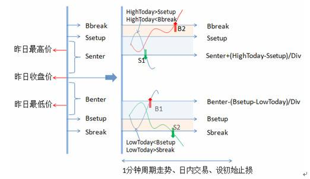

R-Breaker是个经典的具有长生命周期的日内模型

类型：日内趋势追踪+反转策略

周期：1分钟、5分钟

根据前一个交易日的收盘价、最高价和最低价数据通过一定方式计算出六个价位，

从大到小依次为：
突破买入价（buy_break)、观察卖出价(sell_setup)、
反转卖出价(sell_enter)、反转买入价(buy_enter)、
观察买入价(buy_setup)、突破卖出价(sell_break)

以此来形成当前交易日盘中交易的触发条件。
 
交易规则：

- 反转:

    - 持多单，当日内最高价超过观察卖出价后，盘中价格出现回落，且进一步跌破反转卖出价构成的支撑线时，采取反转策略，即在该点位反手做空；

    - 持空单，当日内最低价低于观察买入价后，盘中价格出现反弹，且进一步超过反转买入价构成的阻力线时，采取反转策略，即在该点位反手做多；

- 突破:

    - 在空仓的情况下，如果盘中价格超过突破买入价，则采取趋势策略，即在该点位开仓做多；

    - 在空仓的情况下，如果盘中价格跌破突破卖出价，则采取趋势策略，即在该点位开仓做空；