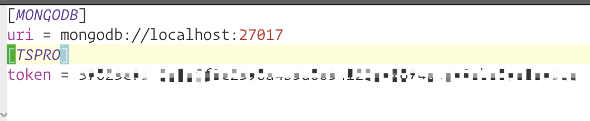
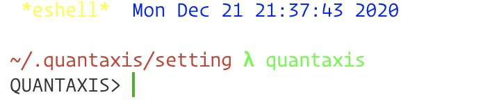
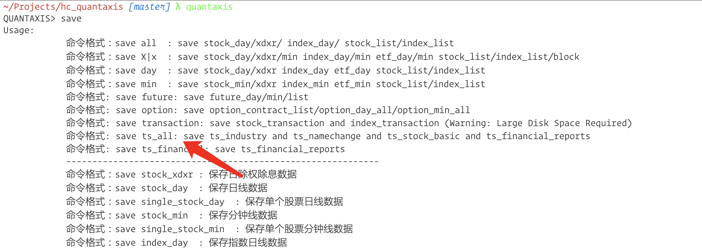
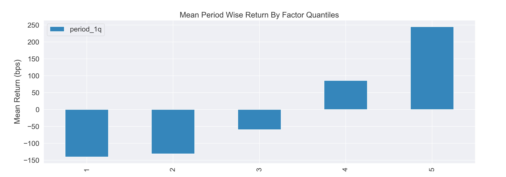
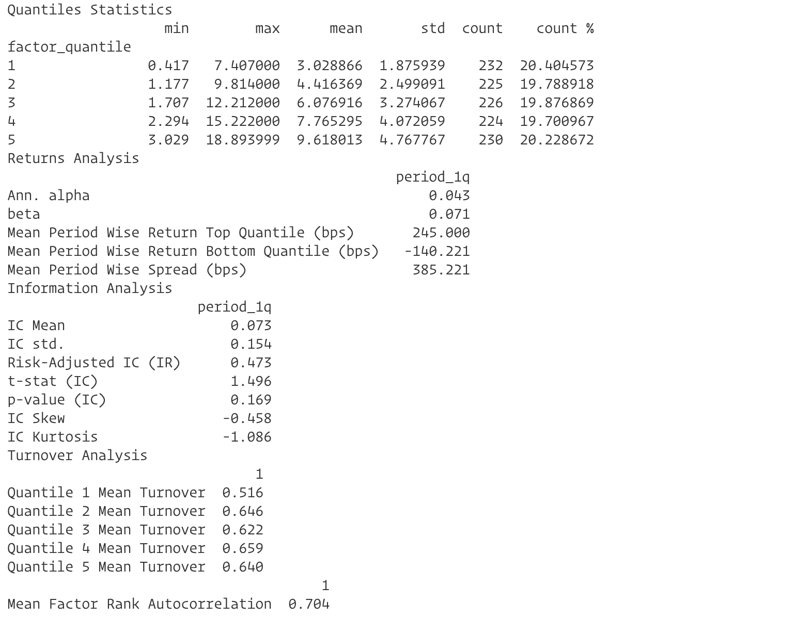

# Table of Contents

1.  [快速上手指南](#orgf6acef4)
    1.  [1. 数据保存](#org4a8e85c)
    2.  [2. 常用接口说明](#orgfb96fc4)
2.  [示例测试代码](#org1b75361)
    1.  [1. ROE 季度数据测试](#org51e35a4)
3.  [其他说明](#org67eccfb)
4.  [TODO](#org17c35b1)
5.  [参考内容](#org94a10fd)

# 快速上手指南

## 1. 数据保存

1.  本模块目前默认基本面数据源为 tushare，由于部分数据属于 tushare 高级数据，因此需要自行购买 tushare 高级版会员，目前高级版会员 500 一年
2.  设置 tushare 的 token
    - 在主目录下的 \`.quantaxis/setting\` 下，修改 \`config.ini\`
    - 添加 TSPRO 记录，设置 &rsquo;tushare&rsquo; 的 token

      
3.  在终端中直接输入 \`quantaxis\`，进入数据保存命令行

    

4.  输入 \`save\`, 可以看到相对应的保存指令

    - \`save tsall\` 会更新所有财务报表 (利润表，资产负债表，现金流量表，不包括业绩预告，业绩快报)
      原始和最新数据，股票历史曾用名，申万三级历史行业分类数据以及股票基本信息
    - \`save tsfinancial\` 会更新股票财务报表数据 (其他信息不用经常更新)

    

## 2. 常用接口说明

1.  \`QAfetchstockbasic\` 函数，可以获取股票基本信息

        def QA_fetch_stock_basic(
                code: Union[str, List, Tuple] = None,
                status: Union[str, List, Tuple] = 'L') -> pd.DataFrame:
            """获取股票基本信息

            Args:
                code (Union[str, List, Tuple], optional): 股票代码或列表，默认为 None，获取全部股票
                status (Union[str, List, Tuple], optional): 股票状态, 默认为 'L', 即仍在上市的股票，如果为 None， 则返回所有状态股票

            Returns:
                pd.DataFrame: 股票基本信息
            """
            pass

2.  \`QAfetchstockname\` 函数，获取股票历史曾用名，可以据此进行历史股票 ST 判断等处理

        def QA_fetch_stock_name(
                code: Union[str, List, Tuple] = None,
                cursor_date: Union[str, datetime.datetime, pd.Timestamp] = None
        ) -> pd.DataFrame:
            """获取股票历史曾用名

            Args:
                code (Union[str, List, Tuple], optional): 股票代码或列表，默认为 None，查询所有股票.
                cursor (Union[str, datetime.datetime, pd.Timestamp], optional): 截止时间，股票名称距离 cursor_date 最近的名字

            Returns:
                pd.DataFrame: 股票历史曾用名
            """
            pass

3.  \`QAfetchindustryname\` 函数，本地获取股票或股票列表的行业信息，目前仅支持申万三级行业

        def QA_fetch_industry_adv(
            code: Union[str, List, Tuple] = None,
            cursor_date: Union[str, datetime.datetime] = None,
            start: Union[str, datetime.datetime] = None,
            end: Union[str, datetime.datetime] = None,
            levels: Union[str, List, Tuple] = None,
            src: str = "sw"
        ) -> pd.DataFrame:
            """本地获取指定股票或股票列表的行业

            Args:
                code (Union[str, List, Tuple], optional): 股票代码或列表，默认为 None, 查询所有股票代码.
                cursor_date (Union[str, datetime.datetime], optional): 一般指调仓日，此时不需要再设置 start 与 end
                start(Union[str, datetime.datetime], optional): 起始时间，默认为 None.
                end(Union[str, datetime.datetime], optional): 截止时间, 默认为 None.
                levels (Union[str, List, Tuple], optional): [description]. 对应行业分级级别，默认为 None，查询所有行业分级数据
                src (str, optional): 分级来源，默认为 "sw"(目前仅支持申万行业分类).

            Returns:
                pd.DataFrame: 行业信息
            """
            pass

4.  \`QAfetchfinancialadv\` 函数，本地获取对应股票列表指定时间范围内或者指定报告期，指定报告类型的财务报表数据

        """本地获取指定股票或者指定股票列表，指定时间范围或者报告期，指定报告类型的指定财务报表数据

        Args:
            code (Union[str, Tuple, List], optional): 指定股票代码或列表，默认为 None, 全市场股票
            start (Union[str, datetime.datetime, pd.Timestamp], optional): 起始时间
            end (Union[str, datetime.datetime, pd.Timestamp], optional): 结束时间
            report_date (Union[str, datetime.datetime, pd.Timestamp], optional): 报告期
            report_type (Union[int, str], optional): 报告类型，默认为 1.
                (1	合并报表	上市公司最新报表（默认）|
                 2	单季合并	单一季度的合并报表 |
                 3	调整单季合并表	调整后的单季合并报表（如果有） |
                 4	调整合并报表	本年度公布上年同期的财务报表数据，报告期为上年度 |
                 5	调整前合并报表	数据发生变更，将原数据进行保留，即调整前的原数据 |
                 11 调整前合并报表	调整之前合并报表原数据)
            sheet_type (str, optional): 报表类型，默认为 "income".
            fields (List, optional): 字段，默认为 None，返回所有字段.

        Returns:
            pd.DataFrame: 指定条件的本地报表数据
        """
        pass

5.  \`QAfetchlastfinancial\` 函数，获取距离指定日期最近的能获取到的财务数据，可以避免历史数据的引入

        def QA_fetch_last_financial(
                code: Union[str, List, Tuple] = None,
                cursor_date: Union[str, datetime.datetime, pd.Timestamp] = None,
                report_label: Union[int, str] = None,
                report_type: Union[int, str, List, Tuple] = None,
                sheet_type: str = "income",
                fields: Union[str, List, Tuple] = None) -> pd.DataFrame:
            """获取距离指定日期 (cursor_date) 最近的原始数据 (不包含在 cursor_date 发布的财务数据)，
               当同时输入 cursor_date 与 report_date 时，以 report_date 作为查询标准
               注意：
                   这里的 report_type 仅支持 (1,4, 5) 三种类型，以避免混淆合并数据和单季数据等
               说明：
                   柳工 (000528) 在 2018 年 8 月 30 日发布半年报，之后在 2018 年 9 月 29 日发布修正报告，
                   - 如果输入的 cursor_date 为 2018-08-31, 那么获取到的就是原始半年报，对应 report_type == 5
                   - 如果输入的 cursor_date 为 2018-09-30，那么获取到的就是最新合并报表，对应 report_type == 1
                   - 如果对应的 cursor_date 为 2019-08-31，需要获取 2018 年半年报，那么就返回柳工在 2019 年 8 月 29 日发布的上年同期基准，对应 report_type == 4

            Args:
                code (Union[str, List, Tuple], optional): 股票代码或股票列表，默认为 None, 查询所有股票
                cursor_date (Union[str, datetime.datetime, pd.Timestamp]): 查询截面日期 (一般指调仓日), 默认为 None
                report_label (Union[str, int], optional): 指定报表类型，这里的类型分类为一季报，半年报，三季报，年报, 默认为 None，即选择距离 cursor_date 最近的报表类型
                report_type (Union[str, List, Tuple], optional): [description]. 报表类型，默认为 None. 即距离 cursor_date 最近的财报，不指定类型，避免引入未来数据
                    (1	合并报表	上市公司最新报表（默认）|
                     4	调整合并报表	本年度公布上年同期的财务报表数据，报告期为上年度 |
                     5	调整前合并报表	数据发生变更，将原数据进行保留，即调整前的原数据)
                sheet_type (str, optional): 报表类型，默认为 "income".
                fields (Union[str, List, Tuple], optional): 字段, 默认为 None, 返回所有字段

            Returns:
                pd.DataFrame: 复合条件的财务数据
            """
            pass

6.  \`QAfetchdailybasic\` 函数，获取指定股票或股票列表在对应时间范围或对应日期的每日基本面数据，数据来源为 \`tushare\` dailybasic 数据

# 示例测试代码

## 1. ROE 季度数据测试

1.  说明：该测试文件使用的是来自通达信的财务数据，利用 QAFactor 进行单因子分析
2.  测试文件目录在 \`QUANTAXIS/QUANTAXISTest/QAFactorTest\` 下面
3.  运行结果如下
    - 截图

      

    - 结果分析

      

# 其他说明

1.  QAFactor 是笔者在 2019 年，参考 jqdatasdk 和 alphalens 写成的，主要数据源为 QUANTAXIS 自带数据，以及聚宽的
    行业数据
2.  2020 年， Python 已经更新到 Python3.9，同时聚宽也开始转型到资管平台，相对应地，一方面聚宽的 sdk 对 Python3.8
    支持不好，另一方面，聚宽的数据接口权限相比之前要求更高，为此，笔者将数据接口修改为 Tushare
3.  Tushare 自带的数据接口有许多问题
    - 网络不好导致数据缺失
    - 分钟内查询次数限制
    - 查询接口过于简陋，不敷实际使用
4.  笔者的计划为 QAFactor 升级为多因子分析模块，目前正在进行中，已完成数据整合处理，但是也有一些问题
    - 多因子分析模块需要输入多因子数据，这一块实际处理可能比想象中更为困难，笔者目前正在撰写相关多因子内容
    - Pandas 模块带来便利的同时，在一些方面依然受限
      - 数据量大的时候，计算速度相比 numpy，是玄学
      - 高频数据因子分析，不敷使用

# TODO

1.  测试用例完善
2.  多因子分析模块
3.  文档细化

# 参考内容

1.  [Fama-French 三因子模型 A 股实证之数据处理篇](https://mp.weixin.qq.com/s/U7bwdgeDoq87g-BfAsqDBQ)
2.  [多因子系列篇五 &#x2013; 当我们说单因子分析的时候，意味着什么](https://mp.weixin.qq.com/s/btz9Z10owpWI0Kha1ihcZg)
3.  [多因子系列篇四 &#x2013; 新角度理解多因子模型与股票黑名单构建](https://mp.weixin.qq.com/s/ZEpuuRCBzIjpmWmnF1pFcg)
