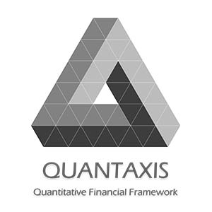

# QUANTAXIS 量化金融策略框架

-------------------------------------------------------------

Quantitative Financial FrameWork

从数据爬取-清洗存储-分析回测-可视化-交易复盘的本地一站式解决方案

## 祝贺 QUANTAXIS 入选 [GITEE 最有价值开源项目 GVP](https://gitee.com/gvp)




[](https://github.com/quantaxis/quantaxis/watchers)
[](https://github.com/quantaxis/quantaxis/stargazers)
[](https://github.com/quantaxis/quantaxis/fork)


> ENGLISH DOCUMENTS PLEASE CLICK [THIS](README_ENG.md)

[点击右上角Star和Watch来跟踪项目进展! 点击Fork来创建属于你的QUANTAXIS!]


[]( https://g.codefresh.io/pipelines/QUANTAXIS/builds?repoOwner=QUANTAXIS&repoName=QUANTAXIS&serviceName=QUANTAXIS%2FQUANTAXIS&filter=trigger:build~Build;branch:master;pipeline:5c3ade3fc67fe4e3328c9da1~QUANTAXIS)
[](https://bettercodehub.com/)
[](https://www.codacy.com/app/yutiansut/QUANTAXIS?utm_source=github.com&utm_medium=referral&utm_content=yutiansut/QUANTAXIS&utm_campaign=badger)
[](https://stackshare.io/yutiansut/quantaxis)


[](https://app.fossa.io/projects/git%2Bgithub.com%2FQUANTAXIS%2FQUANTAXIS?ref=badge_shield)
[](http://waffle.io/yutiansut/QUANTAXIS)
[](https://houndci.com)


> 欢迎加群讨论: 563280067 [群链接](https://jq.qq.com/?_wv=1027&k=4CEKGzn) 

> QUANTAXIS 开发群: 773602202 (如果想要贡献代码 请加这个群 需要备注你的GITHUB ID)

> 欢迎关注公众号: 

> 许多问题 可以在 [GITHUB ISSUE](https://github.com/QUANTAXIS/QUANTAXIS/issues)中找到, 你可以提出新的issue

QUANTAXIS量化金融策略框架,是一个面向中小型策略团队的量化分析解决方案. 我们通过高度解耦的模块化以及标准化协议,可以快速的实现面向场景的定制化解决方案.QUANTAXIS是一个渐进式的开放式框架,你可以根据自己的需要,引入自己的数据,分析方案,可视化过程等,也可以通过RESTful接口,快速实现多人局域网/广域网内的协作.

==========================================


## 关联项目:

- [QUANTAXIS](https://github.com/QUANTAXIS/QUANTAXIS) QUANTAXIS的核心部分
- [QUANTAXIS_MONITOR_GUI](https://github.com/QUANTAXIS/QUANTAXIS_Monitor_GUI) 基于QT的python监控
- [QUANTAXIS_WEBSERVER](https://github.com/QUANTAXIS/QUANTAXIS_WEBSERVER) 基于tornado的web api/ websocket
- [QUANTAXIS_RUN](https://github.com/QUANTAXIS/quantaxis_run) 基于rabbitmq/celery的分布式任务部署
- [QUANTAXIS_PUBSUB](https://github.com/QUANTAXIS/QAPUBSUB) 基于RABBITMQ的消息分发订阅
- [QUANTAXIS_DESKTOP](https://github.com/QUANTAXIS/QADESKTOP) 基于VUE.js/ ELECTRON的 桌面终端
- [portable_QA](https://github.com/QUANTAXIS/portable_QA) 一个独立的python环境,免配置
- [QUANTAXIS_ATBROKER](https://github.com/QUANTAXIS/QA_AtBroker) 基于海风at的接口封装
- [QUANTAXIS_CRAWLY](https://github.com/QUANTAXIS/QUANTAXIS_CRAWLY) 爬虫部分
- [QUANTAXIS_REALTIME_RESOLUTION](https://github.com/yutiansut/QUANTAXIS_REALTIME_RESOLUTION) 实时交易/部署解决方案(未开源)


==========================================

<!-- TOC -->

- [QUANTAXIS 量化金融策略框架](#quantaxis-量化金融策略框架)
    - [1. 功能](#1-功能)
        - [1.1 行情服务](#11-行情服务)
            - [1.1.1 股票/期货/期权/美股/外汇/宏观的历史/实时行情(日线/分钟线/tick/实时五档)服务](#111-股票期货期权美股外汇宏观的历史实时行情日线分钟线tick实时五档服务)
            - [1.1.2 财务/基本面/宏观数据](#112-财务基本面宏观数据)
            - [1.1.3 自定义数据源的数据](#113-自定义数据源的数据)
        - [1.2 数据运维服务](#12-数据运维服务)
        - [1.3 分析服务](#13-分析服务)
            - [1.3.1 专门为A股股票数据适配的数据结构](#131-专门为a股股票数据适配的数据结构)
            - [1.3.2 精心为A股指标计算适配的指标类](#132-精心为a股指标计算适配的指标类)
        - [1.4 可扩展事件驱动框架](#14-可扩展事件驱动框架)
        - [1.5 回测服务](#15-回测服务)
            - [1.5.1 股票/日内t0/ 的日线/分钟线级别回测](#151-股票日内t0-的日线分钟线级别回测)
        - [1.6 实盘](#16-实盘)
            - [1.6.1 股票/实盘易 QAShiPaneBroker](#161-股票-实盘易--qashipanebroker)
            - [1.6.2 股票/TTS    QATTSBroker](#162-股票-tts----qattsbroker)
            - [1.6.3 期货/Open-trade-gateway QAOTGBROKER](#163-期货--qaotgbroker)
            - [1.6.4 期货/海风AT  QA_ATBroker](#164-期货--海风at封装-qaatbroker)
            - [1.6.5 期货/VNPY   QAVNPYBroker](#165-期货-vnpy-qavnpybroker)
        - [1.7 网站HTTP服务](#17-网站http服务)
            - [1.7.1 网站后台标准化接口](#171-网站后台标准化接口)
    - [2. 文档](#2-文档)
    - [3. 安装和部署](#3-安装和部署)
        - [3.0 安装说明](#30-安装说明)
        - [3.1 小白式上手](#31-小白式上手)
        - [3.2 部署式安装](#32-部署式安装)
        - [3.3  本地代码 开发式安装](#33--本地代码-开发式安装)
        - [3.4 代码提交式安装](#34-代码提交式安装)
    - [4. 更新](#4-更新)
    - [5. Docker](#5-docker)
    - [6. 使用说明](#6-使用说明)
    - [7. Jupyter示例](#7-jupyter示例)
    - [8. 开发计划](#8-开发计划)
    - [9. 常见问题FAQ](#9-常见问题faq)
    - [10. 项目捐赠](#10-项目捐赠)
    - [11. 回测Webkit插件概览](#11-回测webkit插件概览)
    - [12. QUANTAXIS 标准化协议和未来协议](#12-quantaxis-标准化协议和未来协议)
    - [13. 电脑配置推荐](#13-电脑配置推荐)
    - [14. 开户](#14-开户无论资金规模)
    - [License](#license)

<!-- /TOC -->


##  1. 功能
======


已经实现：

### 1.1 行情服务

#### 1.1.1 股票/期货/期权/美股/外汇/宏观的历史/实时行情(日线/分钟线/tick/实时五档)服务

参见 [QUANTAXIS的数据获取指南](Documents/DataFetch.md)

#### 1.1.2 财务/基本面/宏观数据

参见 [QUANTAXIS财务指标](Documents/financial_means.md)

#### 1.1.3 自定义数据源的数据

参见 [QUANTAXIS WEB 爬虫](Documents/crawler.md)

### 1.2 数据运维服务

一键更新 参见[WINDOWS数据自动更新](config/windows_autojob_updatedata.md)


### 1.3 分析服务

#### 1.3.1 专门为A股股票数据适配的数据结构

参见 [QUANTAXIS的数据结构](Documents/DataStruct.md)

参见 [QUANTAXIS行情研究](Documents/analysis.md)

#### 1.3.2 精心为A股指标计算适配的指标类

参见 [QUANTAXIS指标系统](Documents/indicators.md)


### 1.4 可扩展事件驱动框架

参见 [QUANTAXIS事件框架](Documents/about_event.md)


### 1.5 回测服务

#### 1.5.1 股票/日内t0/ 的日线/分钟线级别回测

参见 [QUANTAXIS的账户结构](Documents/account.md)

参见 [QUANTAXIS 账户风险分析插件指南](Documents/risk.md)

参见 [QUANTAXIS回测委托成交结算的说明](Documents/orderanddeal.md)

参见 [QUANTAXIS回测分析](Documents/backtestanalysis.md)

参见 [常见策略整理](Documents/strategy.md)

参见 [简单策略回测详解](Documents/QUANTAXIS回测分析全过程讲解.md)

参见 [T0交易的账户详解](Documents/TEST_ORDER_BACKTEST_T0.md)

### 1.6 实盘

#### 1.6.1 (股票) 实盘易  QAShipaneBroker


实盘易插件 参见[实盘易](http://www.iguuu.com/e?x=18839)

实盘易安装注意 参见[安装注意](shipane_install_memo.md)

####  1.6.2 (股票) TTS    QATTSBroker

具体参见[QATTSBroker](QUANTAXIX/QAMARKET/QATTSBroker.py)

#### 1.6.3 (期货)  QAOtgBroker

CTP 的websocket交易 :  simnow demo:  ws://www.yutiansut.com:7988

关于websocket交易(可能存在一些不确定的bug 因此暂时不开放):

- 目前仅提供demo/ 模拟盘接入
- 具体需要私聊我 yutiansut@qq.com

#### 1.6.4 (期货)  海风AT封装 QAAtBroker
CTP 的海风broker魔改封装:  [QA_AtBroker](https://github.com/QUANTAXIS/QA_AtBroker)


#### 1.6.5 (期货) VNPY QAVNPYBroker

目前等VNPY 2.0的横空出世, 兼容py3.6/3.7后将进行对接


### 1.7 网站HTTP服务(目前已经独立为 QUANTAXIS_WEBSERVICE)

#### 1.7.1 网站后台标准化接口

参见 [QUANTAXIS WEB API说明](Documents/backendapi.md)


- [QUANTAXIS 2018开发计划表](job_list.md)


##  2. 文档

文档参见: [book](http://book.yutiansut.com)

下载文档手册(实时更新)

[PDF](https://www.gitbook.com/download/pdf/book/quantaxis/quantaxis) | [MOBI](https://www.gitbook.com/download/mobi/book/quantaxis/quantaxis) | [EPUB](https://www.gitbook.com/download/epub/book/quantaxis/quantaxis)

##  3. 安装和部署

### 3.0 安装说明
参见 [安装说明](Documents/install.md)

### 3.1 小白式上手


参见 [小白上手教程WIN](Documents/install_for_new_to_coding.md)

### 3.2 部署式安装


```
pip install quantaxis -U
```
### 3.3  本地代码 开发式安装

本地安装
```
git clone https://github.com/quantaxis/quantaxis --depth 1

cd quantaxis

pip install -e .
```
### 3.4 代码提交式安装

代码提交式安装 代码提交参见  [代码提交](https://github.com/QUANTAXIS/QUANTAXIS/blob/master/Documents/about_pr.md)

- fork QUANTAXIS 到你的github账户

```
git clone https://github.com/你的账户名/quantaxis
```

##  4. 更新
参见 [更新说明](Documents/update.md)

##  5. Docker
参见 [Docker](Documents/docker.md)
##  6. 使用说明
参见 


* [QUANTAXIS的使用示例](https://github.com/quantaxis/QADemo)


##  7. Jupyter示例
参见 [Jupyter示例](jupyterexample)


##  8. 开发计划
参见 [开发计划](job_list.md)

##  9. 常见问题FAQ

参见 [FAQ](Documents/FAQ.md)

##  10. 项目捐赠

写代码不易...请作者喝杯咖啡呗?


(PS: 支付的时候 请带上你的名字/昵称呀 会维护一个赞助列表~ )

[捐赠列表](CONTRIBUTING.md)


##  11. QUANTAXIS 桌面级产品(全平台 WIN/MAC/LINUX)


参见 [QUANTAXIS/QADESKTOP](https://github.com/quantaxis/qadesktop)


模拟实盘多账户管理


##  12. QUANTAXIS 标准化协议和未来协议


QUANTAXIS-Stardand-Protocol 版本号0.0.8

详情参见  [QUANATXISProtocol](Documents/readme.md)


##  13. 电脑配置推荐

推荐配置:
6代以上CPU+ 16/32GB DDR3/DDR4内存+ 256GB以上SSD硬盘

最低配置:
支持X64位的CPU

因为在存储本地数据的时候,需要存储超过2GB的本地数据,而32位的MONGODB最高只支持2GB左右的数据存储,因此最少需要一个X64位的CPU

如果SSD资源够用,尽量将数据存储在SSD中,增加```wiretiger```写盘的速度

如果是阿里云/腾讯云的服务器,请在最初的时候 选择64位的操作系统


## 14. 开户(无论资金规模):

记得赚了钱赶紧给quantaxis组织捐一点(逃:

### 期货开户
```
即日起到春节前, 中财期货,瑞龙期货 和QUANTAXIS达成协议, 使用quantaxis的量化期货交易者，

- 交易所内返80%(无论资金规模)
- 每月直接返还到交易账户
- 没有中间商赚差价
- 手续费是 交易所+1分

- 享受一次quantaxis期货环境部署远程指导[带行情带下单](看心情)


联系 微信(GX3117) 备注 from quantaxis 

```
### 股票开户
```
股票开户给出两个选择:
1. 长城国瑞证券 万1.2 无五元手续费 (目前还没谈到万1) (联系 QQ 2961725743 备注 from quantaxis)
2. 财通证券 万1.2 无五元手续费 (联系QQ 2939048292 备注 from quantaxis)
3. 财通证券 万1.2 无五元手续费(送开户大礼包 行情/书籍自选一样) (联系QQ 373566682 备注 from quantaxis)

- 享受一次quantaxis股票环境部署远程指导[带行情带下单](看心情)

上述均无资金规模限制 
```

上述广告都已经尽力把价格往下谈了, 均不限制资金规模, 记得报quantaxis哈

PS: 另外如果你是券商/期货的居间人 能给出相似或更有竞争力的价格欢迎来撩


## License
[](https://app.fossa.io/projects/git%2Bgithub.com%2FQUANTAXIS%2FQUANTAXIS?ref=badge_large) [](https://gitter.im/QUANTAXIS_tauruswang/Lobby?utm_source=badge&utm_medium=badge&utm_campaign=pr-badge&utm_content=badge)
