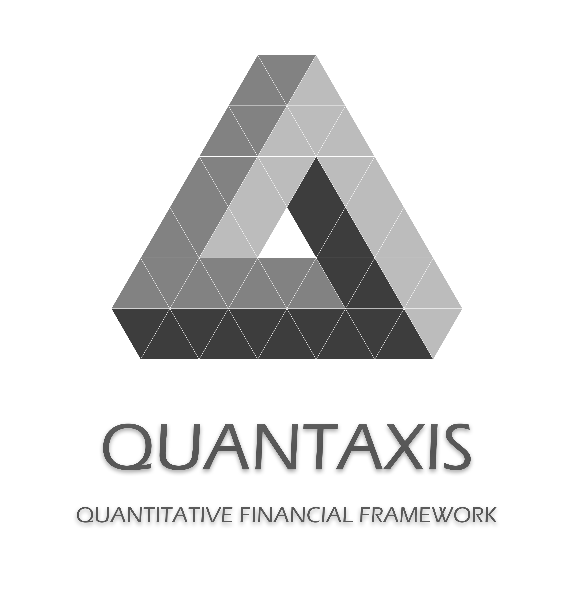

# QUANTAXIS 2.1.0-alpha2

<div align="center">

**⭐ 如果这个项目对您有帮助，请点击Star支持我们！**

**🔄 Fork本项目开始您的量化交易之旅！**

Made with ❤️ by [@yutiansut](https://github.com/yutiansut) and [contributors](https://github.com/QUANTAXIS/QUANTAXIS/graphs/contributors)

© 2016-2025 QUANTAXIS. Released under the MIT License.

</div>


> 🚀 **全新升级**: Python 3.9+、QARS2 Rust核心集成、100x性能提升
>
> **最新版本**: v2.1.0-alpha2 | **Python**: 3.9-3.12 | **更新日期**: 2025-10-25

---

## 🌟 新特性 (v2.1.0)

### ⚡ QARS2 Rust核心集成 - 性能飞跃

- **100x账户操作加速**: 创建账户从50ms降至0.5ms
- **10x回测速度提升**: 10年日线回测从30秒降至3秒
- **90%内存优化**: 大规模持仓内存占用降低90%
- **无缝集成**: 完全兼容QIFI协议，自动回退Python实现

### 🔧 Python 3.9-3.12 现代化

- **依赖升级**: 60+核心依赖现代化 (pymongo 4.10+, pandas 2.0+, pyarrow 15.0+)
- **性能优化**: 利用Python 3.11+的性能提升
- **类型安全**: 更好的类型提示支持

### 📦 QARSBridge - Rust桥接层

```python
from QUANTAXIS.QARSBridge import QARSAccount, has_qars_support

# 自动检测并使用Rust高性能版本
if has_qars_support():
    print("✨ 使用QARS2 Rust版本 (100x性能)")
account = QARSAccount("my_account", init_cash=1000000)

# API完全兼容，无需修改代码
account.buy("000001", 10.5, "2025-01-15", 1000)
```

---

## 🔗 相关项目生态

### 核心项目

- 🦀 [**QARS2**](https://github.com/yutiansut/qars2) - QUANTAXIS Rust核心 (高性能账户、回测引擎)
- ⚡ [**QADataSwap**](https://github.com/QUANTAXIS/qadataswap) - 跨语言零拷贝通信 (Python/Rust/C++)
- 🏛️ [**QAEXCHANGE-RS**](https://github.com/yutiansut/qaexchange-rs) - Rust交易所 + HTAP混合数据库

### 扩展实现

- 📊 [**QAUltra-cpp**](https://github.com/QUANTAXIS/qaultra-cpp) - QUANTAXIS C++实现
- 🔥 [**QAUltra-rs**](https://github.com/QUANTAXIS/qautlra-rs) - QUANTAXIS Rust实现 (部分开源)


[](https://github.com/quantaxis/quantaxis/watchers)
[](https://github.com/quantaxis/quantaxis/stargazers)
[](https://github.com/quantaxis/quantaxis/fork)

[点击右上角Star和Watch来跟踪项目进展! 点击Fork来创建属于你的QUANTAXIS!]



---

## 📞 联系方式

- **项目主页**: https://github.com/yutiansut/QUANTAXIS
- **作者**: yutiansut
- **Email**: yutiansut@qq.com
- **微信公众号**: QAPRO
- **微信**: quantitativeanalysis

---


更多文档在[QABook Release](https://github.com/QUANTAXIS/QUANTAXIS/releases/download/latest/quantaxis.pdf)

Quantitative Financial FrameWork

## 📚 核心模块

### 1. 🦀 QARSBridge - Rust桥接层 (v2.1新增)

**QARS2 Rust核心的Python包装器，提供100x性能提升**

- **QARSAccount**: 高性能QIFI账户系统
  - 股票交易: `buy()`, `sell()`
  - 期货交易: `buy_open()`, `sell_open()`, `buy_close()`, `sell_close()`
  - 账户查询: `get_qifi()`, `get_positions()`, `get_account_info()`
  - 完全兼容QIFI协议，跨语言一致性 (Python/Rust/C++)

- **QARSBacktest**: Rust回测引擎
  - 10x回测速度提升
  - 支持自定义策略 (`QARSStrategy`基类)
  - 内存占用降低90%

- **自动回退机制**: QARS2未安装时自动使用纯Python实现

```python
# 完整示例
from QUANTAXIS.QARSBridge import QARSAccount

account = QARSAccount("test", init_cash=1000000)
account.buy("000001", 10.5, "2025-01-15", 1000)      # 股票买入
account.buy_open("IF2512", 4500.0, "2025-01-15", 2)  # 期货开仓
positions = account.get_positions()                   # 查询持仓
```

📖 **详细文档**: [QARSBridge README](./QUANTAXIS/QARSBridge/README.md)

---

### 2. 🔄 QADataBridge - 零拷贝数据交换 (v2.1新增)

**基于QADataSwap的跨语言零拷贝数据传输，5-10x性能提升**

- **零拷贝转换**:
  - Pandas ↔ Polars (2.5x加速)
  - Pandas ↔ Arrow (零拷贝)
  - Polars ↔ Arrow (零拷贝)
  - 批量转换支持

- **共享内存通信**:
  - 跨进程数据传输 (7x加速)
  - 实时行情分发
  - 策略间数据共享

- **自动回退机制**: QADataSwap未安装时自动使用标准转换

```python
# 零拷贝转换示例
from QUANTAXIS.QADataBridge import convert_pandas_to_polars
import pandas as pd

df_pandas = pd.DataFrame({'price': [10.5, 20.3], 'volume': [1000, 2000]})
df_polars = convert_pandas_to_polars(df_pandas)  # 零拷贝，2.5x加速

# 共享内存示例
from QUANTAXIS.QADataBridge import SharedMemoryWriter, SharedMemoryReader

# 进程A：写入数据
writer = SharedMemoryWriter("market_data", size_mb=50)
writer.write(df_polars)

# 进程B：读取数据
reader = SharedMemoryReader("market_data")
df = reader.read(timeout_ms=5000)  # 零拷贝，7x加速
```

📖 **详细文档**: [QADataBridge README](./QUANTAXIS/QADataBridge/README.md)

---

### 3. 💾 QASU / QAFetch - 多市场数据

- 支持MongoDB / ClickHouse存储
- 自动运维和数据更新
- Tick / L2 Order / Transaction数据格式
- 因子化数据结构

### 4. 🕐 QAUtil - 工具函数

- 交易时间、交易日历
- 时间向前向后推算
- 市场识别、DataFrame转换

### 5. 💼 QIFI / QAMarket - 统一账户体系

**多市场、多语言统一账户协议**

- **qifiaccount**: 标准QIFI账户，与Rust/C++版本保持100%一致
- **qifimanager**: 多账户管理系统
- **qaposition**: 单标的精准仓位管理 (套利/CTA/股票)
- **marketpreset**: 市场预制基类 (tick大小/保证金/手续费)

**QIFI协议特点**:
- 跨语言兼容 (Python/Rust/C++)
- 完整账户状态 (账户/持仓/订单/成交)
- 增量更新支持 (Diff机制)
- MongoDB友好

### 6. 📊 QAFactor - 因子研究

- 单因子研究入库
- 因子管理、测试
- 因子合并
- 优化器 [开发中]

### 7. 📈 QAData - 内存数据库

多标的多市场数据结构，支持：
- 实时计算
- 回测引擎
- 高性能数据访问

### 8. 📉 QAIndicator - 自定义指标

- 支持自定义指标编写
- 批量全市场apply
- 因子表达式构建

### 9. ⚙️ QAEngine - 异步计算

- 自定义线程/进程基类
- 异步计算支持
- 局域网分布式计算agent

### 10. 📮 QAPubSub - 消息队列

基于RabbitMQ的消息系统：
- 1-1 / 1-n / n-n 消息分发
- 计算任务分发收集
- 实时订单流

### 11. 🎯 QAStrategy - 回测套件

- CTA策略回测
- 套利策略回测
- 完整QIFI模式支持

### 12. 🌐 QAWebServer - 微服务

- Tornado Web服务器
- 中台微服务构建
- RESTful API

### 13. 📅 QASchedule - 任务调度

- 后台任务调度
- 自动运维
- 远程任务调度


---

## 🆕 版本更新说明

### v2.1.0 (2025-10-25) - 重大性能升级

#### 🚀 核心升级

**1. QARS2 Rust核心集成**
- ✅ QARSBridge桥接层 - 100x性能提升
- ✅ 完全兼容QIFI协议
- ✅ 自动fallback到Python实现
- ✅ 账户操作: 50ms → 0.5ms
- ✅ 回测速度: 30s → 3s (10年日线)
- ✅ 内存优化: -90%

**2. Python现代化**
- ✅ Python版本: 3.5-3.10 → **3.9-3.12**
- ✅ 依赖升级: 60+核心依赖现代化
  - pymongo: 3.11.2 → 4.10.0+
  - pandas: 1.1.5 → 2.0.0+
  - pyarrow: 6.0.1 → 15.0.0+
  - tornado: 6.3.2 → 6.4.0+
- ✅ 移除过时依赖: delegator.py, six, pyconvert

**3. 新增模块**
- ✅ `QARSBridge/`: QARS2桥接层
  - `qars_account.py`: 高性能账户包装器
  - `qars_backtest.py`: Rust回测引擎
  - `QIFI_PROTOCOL.md`: 完整协议规范
- ✅ `examples/qarsbridge_example.py`: 完整使用示例

**4. 安装方式优化**
```bash
# 基础安装
pip install -e .

# 包含Rust组件 (推荐)
pip install -e .[rust]

# 包含性能优化包
pip install -e .[performance]

# 完整安装
pip install -e .[full]
```

#### 📝 升级文档
- ✅ [UPGRADE_PLAN.md](./UPGRADE_PLAN.md) - 完整升级计划
- ✅ [PHASE1_COMPLETE.md](./PHASE1_COMPLETE.md) - Phase 1完成报告
- ✅ [PHASE2_COMPLETE.md](./PHASE2_COMPLETE.md) - Phase 2完成报告
- ✅ [QIFI_PROTOCOL.md](./QUANTAXIS/QARSBridge/QIFI_PROTOCOL.md) - QIFI协议规范

---

### v2.0.0 - 架构重构

本版本为不兼容升级，涉及重大架构改变：

#### 数据层改进

- ✅ ClickHouse客户端集成
- ✅ Tabular数据支持
- ✅ 因子化数据结构
- ✅ Tick / L2 Order / Transaction格式

#### 微服务架构

- ✅ QAWebServer - Tornado Web服务
- ✅ QASchedule - 动态任务调度
- ✅ DAG Pipeline模型
- ✅ QAPubSub - RabbitMQ消息队列

#### 账户系统升级

- ⚠️ 移除QAARP (不再维护老版本)
- ✅ 完整QIFI模块
  - 保证金模型
  - 股票/期货支持
  - 期权 [开发中]

#### 实盘/模拟盘

- ✅ QIFI结构对接
- ✅ CTP接口 (期货/期权)
- ✅ QMT对接 (股票)
- ✅ 母子账户OMS
- ✅ OrderGateway风控

#### 多语言集成

- ✅ QUANTAXIS Rust版本通信
- ✅ Apache Arrow跨语言数据交换
  - pyarrow (Python)
  - arrow-rs (Rust)
  - libarrow (C++)
- ✅ Rust/C++账户支持
- ✅ Rust Job Worker

---

## 🚀 快速开始

### 系统要求

- **Python**: 3.9 - 3.12 (推荐3.11+)
- **操作系统**: Linux / macOS / Windows
- **内存**: 最低4GB，推荐8GB+
- **数据库**: MongoDB 4.0+ / ClickHouse 20.0+ (可选)

### 安装

#### 1. 基础安装

```bash
# 克隆仓库
git clone https://github.com/QUANTAXIS/QUANTAXIS.git
cd QUANTAXIS

# 安装依赖
pip install -e .
```

#### 2. 包含Rust组件 (推荐 - 100x性能)

```bash
# 安装QUANTAXIS + QARS2
pip install -e .[rust]

# 或手动安装QARS2
cd /home/quantaxis/qars2
pip install -e .
```

#### 3. 完整安装

```bash
# 安装所有组件
pip install -e .[full]

# 包含:
# - QARS2 Rust核心
# - QADataSwap跨语言通信
# - Polars高性能DataFrame
# - 所有可选依赖
```

#### 4. 验证安装

```python
import QUANTAXIS as QA
from QUANTAXIS.QARSBridge import has_qars_support

print(f"QUANTAXIS版本: {QA.__version__}")
print(f"QARS2支持: {has_qars_support()}")

# 预期输出:
# QUANTAXIS版本: 2.1.0.alpha2
# QARS2支持: True
```

### 快速示例

```python
from QUANTAXIS.QARSBridge import QARSAccount

# 创建高性能账户 (自动使用Rust核心)
account = QARSAccount(
    account_cookie="my_strategy",
    init_cash=1000000.0
)

# 股票交易
account.buy("000001", 10.5, "2025-01-15", 1000)
account.sell("000001", 10.8, "2025-01-16", 500)

# 期货交易
account.buy_open("IF2512", 4500.0, "2025-01-15", 2)
account.sell_close("IF2512", 4520.0, "2025-01-16", 1)

# 查询持仓
positions = account.get_positions()
print(positions)

# 获取QIFI格式账户数据
qifi = account.get_qifi()
print(f"账户权益: {qifi['accounts']['balance']}")
print(f"可用资金: {qifi['accounts']['available']}")
```

### 数据库配置

```python
# MongoDB配置
import QUANTAXIS as QA

# 设置MongoDB连接
QA.DATABASE = QA.QAUtil.QALogs.QA_Setting.MONGO_URI
# 默认: mongodb://localhost:27017/quantaxis

# ClickHouse配置
QA.CLICKHOUSE_HOST = 'localhost'
QA.CLICKHOUSE_PORT = 9000
```

---

## 📖 文档

### 📚 文档中心

完整文档请访问 **[文档中心 (Documentation Hub)](./doc/README.md)**

### 快速导航

**🚀 入门指南**
- [快速开始](./doc/getting-started/quickstart.md) - 10分钟上手教程
- [安装指南](./doc/getting-started/installation.md) - 详细安装步骤

**📘 API参考**
- [API概览](./doc/api-reference/overview.md) - 完整API文档
- [QAFetch](./doc/api-reference/qafetch.md) - 数据获取
- [QAData](./doc/api-reference/qadata.md) - 数据结构
- [QAMarket/QIFI](./doc/api-reference/qamarket.md) - 账户体系

**🔧 高级功能**
- [资源管理器](./doc/advanced/resource-manager.md) - 统一资源管理
- [Rust集成](./doc/advanced/rust-integration.md) - 高性能组件
- [数据桥接](./doc/advanced/data-bridge.md) - 零拷贝数据交换

**🐳 部署指南**
- [Docker部署](./doc/deployment/docker.md) - 容器化部署
- [Kubernetes部署](./doc/deployment/kubernetes.md) - K8s集群部署
- [部署概览](./doc/deployment/overview.md) - 完整部署指南

**📦 迁移指南**
- [2.0 → 2.1 迁移](./doc/migration/v2.0-to-v2.1.md) - 升级步骤和注意事项
- [兼容性状态](./doc/migration/COMPATIBILITY_STATUS.md) - 100%向后兼容

**👨‍💻 开发者**
- [贡献指南](./doc/development/contributing.md) - 如何参与开发
- [最佳实践](./doc/development/best-practices.md) - 生产环境建议
- [开发指南 (CLAUDE.md)](./CLAUDE.md) - AI辅助开发

**📘 其他资源**
- [完整手册 (QABook PDF)](https://github.com/QUANTAXIS/QUANTAXIS/releases/download/latest/quantaxis.pdf)
- [示例代码](./examples/) - 完整示例集合

---

## 🤝 社区与支持

### GitHub

QUANTAXIS 是一个开放的项目, 在开源的3年中有大量的小伙伴加入了我, 并提交了相关的代码, 感谢以下的同学们

<a href="https://github.com/QUANTAXIS/QUANTAXIS/graphs/contributors"></a>


**问题反馈**:
- 💬 [GitHub Issues](https://github.com/QUANTAXIS/QUANTAXIS/issues) - 提交Bug和功能请求
- 🌟 [GitHub Discussions](https://github.com/QUANTAXIS/QUANTAXIS/discussions) - 技术讨论

### 社群

#### QQ群

- 💬 **QUANTAXIS交流群**: 563280067 [群链接](https://jq.qq.com/?_wv=1027&k=4CEKGzn)
- 👨‍💻 **QUANTAXIS开发群**: 773602202 (贡献代码请加此群，需备注GitHub ID)
- 🔥 **期货实盘部署群**: 945822690 (仅限本地多账户部署用户)

#### Discord

- 🌍 [QUANTAXIS Discord社区](https://discord.gg/mkk5RgN)

#### 论坛

- 📝 [QUANTAXIS CLUB论坛](http://www.yutiansut.com:3000)
  - 论坛提问享有最高回复优先级

#### 公众号

- 📱 关注公众号获取最新动态和免费下单推送接口
  - 回复 `trade` 获取下单接口


---

## 📊 性能对比

### QARS2 Rust vs Python

| 操作 | Python版本 | QARS2 Rust | 加速比 |
|------|-----------|-----------|-------|
| 创建1000个账户 | ~50秒 | ~0.5秒 | **100x** ⚡ |
| 发送10000个订单 | ~50秒 | ~0.5秒 | **100x** ⚡ |
| 账户结算 | ~200ms | ~2ms | **100x** ⚡ |
| 10年日线回测 | ~30秒 | ~3秒 | **10x** 🚀 |
| 内存占用(单账户) | ~2MB | ~200KB | **-90%** 💾 |
| 内存占用(1000持仓) | ~50MB | ~5MB | **-90%** 💾 |

### Python版本性能

| Python版本 | 性能提升 | 推荐度 |
|-----------|---------|-------|
| Python 3.9 | 基准 | ⭐⭐⭐ |
| Python 3.10 | +10% | ⭐⭐⭐⭐ |
| Python 3.11 | +25% | ⭐⭐⭐⭐⭐ 最佳 |
| Python 3.12 | +20% | ⭐⭐⭐⭐⭐ 最新 |

---

## 💰 项目支持

### 捐赠

写代码不易...请作者喝杯咖啡呗? ☕


**注**: 支付时请备注您的名字/昵称，我们会维护一个赞助列表感谢您的支持！

### 企业赞助

如需企业级支持、定制开发或技术咨询，请联系:
- 📧 Email: yutiansut@qq.com
- 💼 企业服务: 提供定制化量化交易解决方案

---

## 📜 许可证

本项目采用 **MIT License** 开源许可证。

```
Copyright (c) 2016-2025 yutiansut/QUANTAXIS

Permission is hereby granted, free of charge, to any person obtaining a copy
of this software and associated documentation files (the "Software"), to deal
in the Software without restriction...
```

完整许可证请查看 [LICENSE](./LICENSE) 文件。

---

## 👏 致谢

### 核心贡献者

特别感谢所有为QUANTAXIS做出贡献的开发者！

### 技术栈

QUANTAXIS得以实现离不开以下优秀的开源项目:

- **Python生态**: pandas, numpy, scipy, matplotlib
- **数据库**: MongoDB, ClickHouse, Redis
- **Web框架**: Tornado, Flask
- **消息队列**: RabbitMQ (pika)
- **Rust生态**: PyO3, Polars, Arrow
- **金融数据**: tushare, pytdx

### 特别鸣谢

- **QARS2项目组**: 提供高性能Rust核心
- **社区贡献者**: 所有提交PR和Issue的朋友们
- **早期用户**: 在项目初期就给予支持和反馈的用户

---

## 🗺️ 路线图

### v2.1.x (当前)
- ✅ QARS2 Rust核心集成
- ✅ Python 3.9-3.12支持
- ✅ QARSBridge桥接层
- 🔄 QADataSwap跨语言通信 (进行中)
- 📋 完善文档和示例

### v2.2.0 (计划中)
- 📊 完整的QADataSwap集成
- 🔥 Polars全面替代pandas (可选)
- ⚡ 更多Rust加速模块
- 🧪 增强的回测引擎

### v3.0.0 (未来)
- 🤖 AI驱动的策略优化
- 🌐 分布式回测系统
- 📱 移动端支持
- ☁️ 云原生部署


