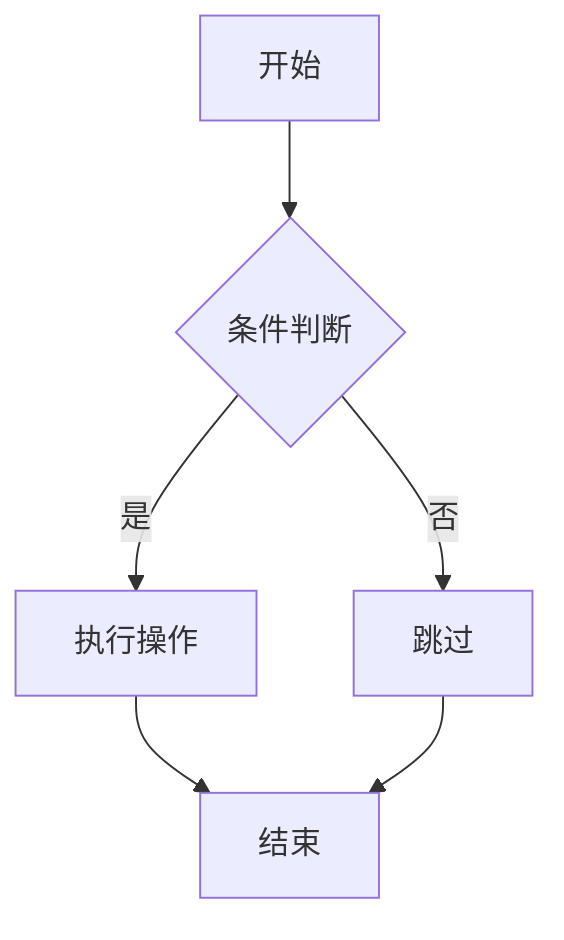

# QUANTAXIS mdbook 文档系统使用指南

**版本**: 2.1.0-alpha2
**更新日期**: 2025-10-25
**作者**: @yutiansut @quantaxis

---

## 📚 简介

QUANTAXIS使用[mdbook](https://rust-lang.github.io/mdBook/)来构建和管理项目文档。mdbook是一个基于Rust的静态文档生成器，具有以下特点:

- ✅ **快速高效**: Rust编写，构建速度极快
- ✅ **Markdown支持**: 使用标准Markdown语法
- ✅ **搜索功能**: 内置全文搜索
- ✅ **主题切换**: 支持亮色/暗色主题
- ✅ **打印友好**: 可导出PDF格式
- ✅ **插件扩展**: 支持Mermaid图表、目录生成等

---

## 🚀 快速开始

### 方法1: 使用便捷脚本 (推荐)

```bash
# 仅构建文档
bash scripts/build_docs.sh

# 构建并启动预览服务器
bash scripts/build_docs.sh --serve
```

脚本会自动:
1. 检查并安装mdbook (如果未安装)
2. 构建文档到`book/`目录
3. (可选) 启动本地预览服务器在 http://localhost:3000

### 方法2: 手动安装和使用

#### 1. 安装mdbook

**Linux/macOS**:
```bash
# 下载预编译二进制
curl -sSL https://github.com/rust-lang/mdBook/releases/download/v0.4.40/mdbook-v0.4.40-x86_64-unknown-linux-gnu.tar.gz | tar -xz
sudo mv mdbook /usr/local/bin/

# 或者使用Cargo安装
cargo install mdbook
```

**Windows**:
```powershell
# 使用Cargo安装
cargo install mdbook

# 或下载预编译版本
# https://github.com/rust-lang/mdBook/releases
```

#### 2. 安装插件 (可选但推荐)

```bash
# Mermaid图表支持
cargo install mdbook-mermaid

# 目录生成
cargo install mdbook-toc

# 链接检查
cargo install mdbook-linkcheck
```

#### 3. 构建文档

```bash
# 进入项目根目录
cd /path/to/QUANTAXIS

# 构建文档
mdbook build

# 或启动预览服务器
mdbook serve --open
```

---

## 📁 文档结构

```
QUANTAXIS/
├── book.toml              # mdbook配置文件
├── doc/                   # 文档源文件目录
│   ├── SUMMARY.md         # 目录结构 (重要!)
│   ├── README.md          # 文档首页
│   ├── getting-started/   # 入门指南
│   ├── user-guide/        # 用户指南
│   ├── api-reference/     # API参考
│   ├── advanced/          # 高级功能
│   ├── deployment/        # 部署指南
│   ├── development/       # 开发指南
│   └── migration/         # 迁移指南
└── book/                  # 构建输出目录 (自动生成)
```

### SUMMARY.md 的重要性

`doc/SUMMARY.md`是mdbook的核心配置文件，定义了:
- 文档的章节结构
- 导航菜单层级
- 文档之间的链接关系

**示例**:
```markdown
# QUANTAXIS 文档目录

[介绍](README.md)

# 🚀 入门指南
- [安装指南](getting-started/installation.md)
- [快速开始](getting-started/quickstart.md)

# 📘 API参考
- [API概览](api-reference/overview.md)
```

---

## ✍️ 编写文档

### 基本Markdown语法

```markdown
# 一级标题
## 二级标题
### 三级标题

**粗体** *斜体* `代码`

- 列表项1
- 列表项2

1. 有序列表1
2. 有序列表2

[链接文本](./other-page.md)


```

### 代码块

````markdown
```python
# Python代码示例
import QUANTAXIS as QA

account = QA.QA_Account()
```

```bash
# Bash命令示例
pip install quantaxis
```
````

### Mermaid图表

````markdown

````

渲染结果:


### 提示框

```markdown
> **提示**: 这是一个提示信息

> **警告**: 这是一个警告信息

> **注意**: 这是一个注意事项
```

### 内部链接

```markdown
# 相对路径链接
[API参考](../api-reference/overview.md)

# 锚点链接
[跳转到安装章节](#安装)
```

---

## 🔧 配置说明

### book.toml 配置文件

```toml
[book]
title = "QUANTAXIS 2.1 文档中心"
authors = ["@yutiansut", "@quantaxis"]
language = "zh-CN"                    # 中文文档
src = "doc"                           # 源文件目录

[build]
build-dir = "book"                    # 输出目录

[output.html]
default-theme = "light"               # 默认亮色主题
preferred-dark-theme = "navy"         # 暗色主题
git-repository-url = "..."            # GitHub仓库链接
edit-url-template = "..."             # 编辑页面模板

[output.html.search]
enable = true                         # 启用搜索
```

### 主题定制

创建`theme/`目录可自定义CSS和模板:

```
doc/
└── theme/
    ├── css/
    │   └── custom.css     # 自定义CSS
    ├── index.hbs          # 自定义HTML模板
    └── favicon.png        # 自定义图标
```

---

## 🌐 GitHub Pages自动发布

### 配置说明

项目已配置GitHub Actions自动发布:

**触发条件**:
- 推送到`master`分支
- `doc/`目录有更新
- `book.toml`配置变更

**工作流程**:
1. ✅ 检出代码
2. ✅ 安装mdbook和插件
3. ✅ 构建文档
4. ✅ 发布到GitHub Pages

**访问地址**: `https://<username>.github.io/QUANTAXIS/`

### 启用GitHub Pages

1. 进入仓库的 **Settings** → **Pages**
2. **Source** 选择 `GitHub Actions`
3. 推送代码到`master`分支触发构建
4. 等待几分钟后访问发布地址

---

## 📝 最佳实践

### 1. 文档组织

- ✅ 使用清晰的目录结构
- ✅ 每个文件只聚焦一个主题
- ✅ 文件名使用小写和连字符 (如`getting-started.md`)

### 2. 内容编写

- ✅ 开头提供简要说明
- ✅ 使用标题组织内容层级
- ✅ 提供代码示例
- ✅ 添加截图和图表
- ✅ 内部链接使用相对路径

### 3. 代码示例

- ✅ 完整可运行的示例
- ✅ 添加注释说明
- ✅ 提供预期输出
- ✅ 标注Python版本要求

### 4. 版本管理

- ✅ 在文档顶部标注版本号
- ✅ 更新时修改日期
- ✅ 重大变更添加到CHANGELOG

---

## 🚀 高级功能

### 1. 多语言支持

```toml
[book]
multilingual = true

[book.language.zh-CN]
title = "QUANTAXIS 文档"

[book.language.en]
title = "QUANTAXIS Documentation"
```

### 2. 自定义预处理器

在`book.toml`中添加:

```toml
[preprocessor.custom]
command = "python scripts/custom_preprocessor.py"
```

### 3. PDF导出

```bash
# 安装mdbook-pdf
cargo install mdbook-pdf

# 配置book.toml
[output.pdf]
enable = true

# 构建PDF
mdbook build
```

### 4. 多版本文档

```bash
# 为不同版本创建分支
git checkout -b docs-v2.0
# ... 编辑文档 ...

git checkout -b docs-v2.1
# ... 编辑文档 ...
```

---

## 🔍 常见问题

### Q1: 文档构建失败怎么办?

**检查**:
```bash
# 验证SUMMARY.md语法
mdbook test

# 检查链接
mdbook build 2>&1 | grep -i error
```

**常见错误**:
- `SUMMARY.md`中的链接路径错误
- Markdown语法错误
- 文件不存在

### Q2: 如何添加新页面?

1. 在`doc/`相应目录创建`.md`文件
2. 在`doc/SUMMARY.md`中添加链接
3. 构建预览: `mdbook serve`

### Q3: 插件不工作怎么办?

```bash
# 确认插件已安装
which mdbook-mermaid
which mdbook-toc

# 重新安装
cargo install --force mdbook-mermaid
cargo install --force mdbook-toc
```

### Q4: GitHub Pages没有更新?

1. 检查Actions是否成功运行
2. 确认Pages设置为`GitHub Actions`源
3. 清除浏览器缓存
4. 等待几分钟让DNS传播

---

## 📚 参考资源

### 官方文档
- [mdbook官方文档](https://rust-lang.github.io/mdBook/)
- [mdbook GitHub仓库](https://github.com/rust-lang/mdBook)
- [Markdown指南](https://www.markdownguide.org/)

### 插件文档
- [mdbook-mermaid](https://github.com/badboy/mdbook-mermaid)
- [mdbook-toc](https://github.com/badboy/mdbook-toc)
- [mdbook-linkcheck](https://github.com/Michael-F-Bryan/mdbook-linkcheck)

### 示例项目
- [Rust语言圣经](https://github.com/sunface/rust-course)
- [Rust程序设计语言](https://github.com/rust-lang/book)

---

## 🤝 贡献文档

欢迎改进QUANTAXIS文档!

**步骤**:
1. Fork本仓库
2. 创建文档分支: `git checkout -b docs/improve-xxx`
3. 编辑`doc/`下的文件
4. 本地测试: `mdbook serve`
5. 提交PR

**注意事项**:
- 遵循现有文档风格
- 添加必要的代码示例
- 更新`doc/SUMMARY.md`
- 测试所有链接有效性

---

**维护者**: @yutiansut @quantaxis
**最后更新**: 2025-10-25

[返回文档中心](README.md)
