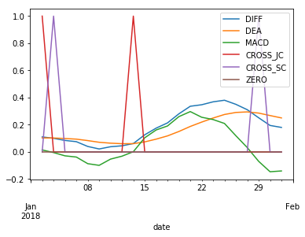
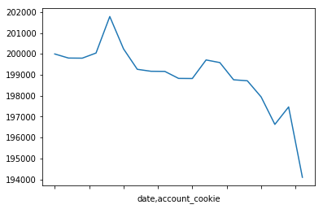
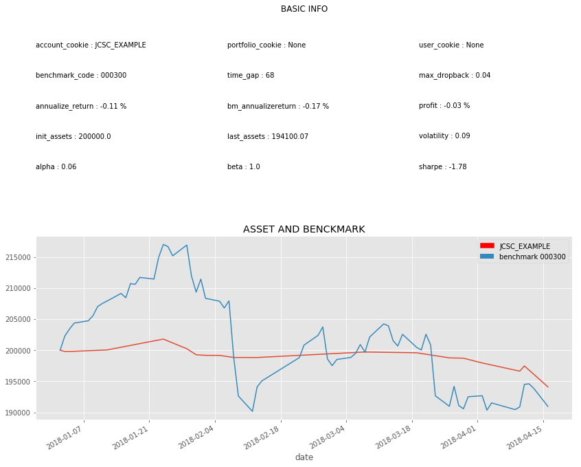
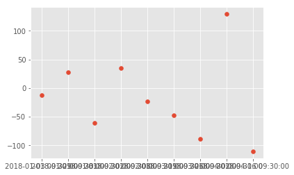

```python
import QUANTAXIS as QA
try:
    assert QA.__version__>='1.0.45'
except AssertionError:
    print('pip install QUANTAXIS >= 1.0.45 请升级QUANTAXIS后再运行此示例')
```


```python
print('首先确定你已经完成了对于QUANTAXIS的基础认知,以及在本地存储完毕了QUANTAXIS的数据库')
```

    首先确定你已经完成了对于QUANTAXIS的基础认知,以及在本地存储完毕了QUANTAXIS的数据库
    

# QUANTAXIS 回测的一些基础知识

##  QA回测的核心是两个类

```
QA_BacktestBroker
QA_Account
```

##  回测数据的引入/迭代

```
QA.QA_fetch_stock_day_adv
QA.QA_fetch_stock_min_adv
```

##  指标的计算

```
DataStruct.add_func
```

##  对于账户的灵活运用

```
QA_Account
QA_Risk
QA_Portfolio
QA_PortfolioView
QA_User
```

## STEP1 初始化账户,初始化回测broker


```python
Account=QA.QA_Account()
Broker=QA.QA_BacktestBroker()
```


```python
# 打印账户的信息
try:
    from pprint import  pprint as print
except:
    pass
print(Account.message)
```

    {'account_cookie': 'Acc_CgcMzSZD',
     'allow_sellopen': False,
     'allow_t0': False,
     'broker': 'backtest',
     'cash': [1000000],
     'commission_coeff': 0.00025,
     'current_time': None,
     'history': [],
     'init_assets': 1000000,
     'margin_level': False,
     'market_type': 'stock_cn',
     'portfolio_cookie': None,
     'running_time': datetime.datetime(2018, 6, 6, 13, 57, 58, 389135),
     'source': 'account',
     'strategy_name': None,
     'tax_coeff': 0.0015,
     'trade_index': [],
     'user_cookie': None}
    

## 首先讲解Account类:

QA_Account在初始化的时候,可以自己指定很多信息:

```
QA_Account(strategy_name=None, user_cookie=None, market_type=MARKET_TYPE.STOCK_CN, frequence=FREQUENCE.DAY,
                 broker=BROKER_TYPE.BACKETEST, portfolio_cookie=None, account_cookie=None,
                 sell_available={}, init_assets=None, cash=None, history=None, commission_coeff=0.00025, tax_coeff=0.0015,
                 margin_level=False, allow_t0=False, allow_sellopen=False)
                 
        :param strategy_name:  策略名称
        :param user_cookie:   用户cookie
        :param market_type:   市场类别 默认QA.MARKET_TYPE.STOCK_CN A股股票
        :param frequence:     账户级别 默认日线QA.FREQUENCE.DAY
        :param broker:        BROEKR类 默认回测 QA.BROKER_TYPE.BACKTEST
        :param portfolio_cookie: 组合cookie
        :param account_cookie:   账户cookie
        :param sell_available:   可卖股票数
        :param init_assets:       初始资产  默认 1000000 元 （100万）
        :param cash:              可用现金  默认 是 初始资产  list 类型
        :param history:           交易历史
        :param commission_coeff:  交易佣金 :默认 万2.5   float 类型
        :param tax_coeff:         印花税   :默认 千1.5   float 类型
        :param margin_level:      保证金比例 默认False
        :param allow_t0:          是否允许t+0交易  默认False
        :param allow_sellopen:    是否允许卖空开仓  默认False
```


```python
# 重设账户初始资金

Account.reset_assets(200000)
Account.account_cookie='JCSC_EXAMPLE'
```


```python
Account.init_assets
```


    200000


Account 有很多方法,暂时不详细展开,我们先直接进入下一步

# SETP2:引入回测的市场数据

引入方法非常简单,直接使用QA_fetch_stock_day_adv系列即可

- code 可以是多种多样的选取方式

```python
1. QA.QA_fetch_stock_list_adv().code.tolist() # 获取全市场的股票代码
2. QA.QA_fetch_stock_block_adv().get_block('云计算').code  # 按版块选取
3. code= ['000001','000002'] # 自己指定
```
- 数据获取后,to_qfq() 即可获得前复权数据

```python
data=DataSturct.to_qfq()
```


```python
# QA.QA_fetch_stock_list_adv().code.tolist()
# QA.QA_fetch_stock_block_adv().get_block('云计算').code

```


```python
data=QA.QA_fetch_stock_day_adv(['000001','000002','000004','600000'],'2017-09-01','2018-05-20')
```


```python
data
```


    < QA_DataStruct_Stock_day with 4 securities >


```python
data=data.to_qfq()
```


```python
# data.data
```

## STEP3:计算一些指标

指标的计算可以在回测前,也可以在回测中进行

回测前的计算则是批量计算,效率较高

回测中的计算,效率略低,但代码量较小,易于理解

PS: 指标的相关介绍参见 [QUANTAXIS的指标系统](https://github.com/QUANTAXIS/QUANTAXIS/blob/master/Documents/indicators.md)


```python
import numpy as np
import pandas as pd
def MACD_JCSC(dataframe,SHORT=12,LONG=26,M=9):
    """
    1.DIF向上突破DEA，买入信号参考。
    2.DIF向下跌破DEA，卖出信号参考。
    """
    CLOSE=dataframe.close
    DIFF =QA.EMA(CLOSE,SHORT) - QA.EMA(CLOSE,LONG)
    DEA = QA.EMA(DIFF,M)
    MACD =2*(DIFF-DEA)

    CROSS_JC=QA.CROSS(DIFF,DEA)
    CROSS_SC=QA.CROSS(DEA,DIFF)
    ZERO=0
    return pd.DataFrame({'DIFF':DIFF,'DEA':DEA,'MACD':MACD,'CROSS_JC':CROSS_JC,'CROSS_SC':CROSS_SC,'ZERO':ZERO})
```


```python
ind=data.add_func(MACD_JCSC)
```


```python
ind.xs('000001',level=1)['2018-01'].plot()
```


    <matplotlib.axes._subplots.AxesSubplot at 0x1cf0d591d68>





```python
ind.xs('000001',level=1)['2018-01']
```


<div>
<style scoped>
    .dataframe tbody tr th:only-of-type {
        vertical-align: middle;
    }

    .dataframe tbody tr th {
        vertical-align: top;
    }

    .dataframe thead th {
        text-align: right;
    }
</style>
<table border="1" class="dataframe">
  <thead>
    <tr style="text-align: right;">
      <th></th>
      <th>DIFF</th>
      <th>DEA</th>
      <th>MACD</th>
      <th>CROSS_JC</th>
      <th>CROSS_SC</th>
      <th>ZERO</th>
    </tr>
    <tr>
      <th>date</th>
      <th></th>
      <th></th>
      <th></th>
      <th></th>
      <th></th>
      <th></th>
    </tr>
  </thead>
  <tbody>
    <tr>
      <th>2018-01-02</th>
      <td>0.110686</td>
      <td>0.103225</td>
      <td>0.014921</td>
      <td>1</td>
      <td>0</td>
      <td>0</td>
    </tr>
    <tr>
      <th>2018-01-03</th>
      <td>0.100387</td>
      <td>0.102657</td>
      <td>-0.004541</td>
      <td>0</td>
      <td>1</td>
      <td>0</td>
    </tr>
    <tr>
      <th>2018-01-04</th>
      <td>0.084801</td>
      <td>0.099086</td>
      <td>-0.028570</td>
      <td>0</td>
      <td>0</td>
      <td>0</td>
    </tr>
    <tr>
      <th>2018-01-05</th>
      <td>0.075607</td>
      <td>0.094390</td>
      <td>-0.037566</td>
      <td>0</td>
      <td>0</td>
      <td>0</td>
    </tr>
    <tr>
      <th>2018-01-08</th>
      <td>0.040453</td>
      <td>0.083603</td>
      <td>-0.086299</td>
      <td>0</td>
      <td>0</td>
      <td>0</td>
    </tr>
    <tr>
      <th>2018-01-09</th>
      <td>0.022012</td>
      <td>0.071285</td>
      <td>-0.098545</td>
      <td>0</td>
      <td>0</td>
      <td>0</td>
    </tr>
    <tr>
      <th>2018-01-10</th>
      <td>0.038391</td>
      <td>0.064706</td>
      <td>-0.052629</td>
      <td>0</td>
      <td>0</td>
      <td>0</td>
    </tr>
    <tr>
      <th>2018-01-11</th>
      <td>0.045208</td>
      <td>0.060806</td>
      <td>-0.031197</td>
      <td>0</td>
      <td>0</td>
      <td>0</td>
    </tr>
    <tr>
      <th>2018-01-12</th>
      <td>0.061988</td>
      <td>0.061043</td>
      <td>0.001890</td>
      <td>1</td>
      <td>0</td>
      <td>0</td>
    </tr>
    <tr>
      <th>2018-01-15</th>
      <td>0.126236</td>
      <td>0.074081</td>
      <td>0.104309</td>
      <td>0</td>
      <td>0</td>
      <td>0</td>
    </tr>
    <tr>
      <th>2018-01-16</th>
      <td>0.175134</td>
      <td>0.094292</td>
      <td>0.161683</td>
      <td>0</td>
      <td>0</td>
      <td>0</td>
    </tr>
    <tr>
      <th>2018-01-17</th>
      <td>0.213839</td>
      <td>0.118201</td>
      <td>0.191275</td>
      <td>0</td>
      <td>0</td>
      <td>0</td>
    </tr>
    <tr>
      <th>2018-01-18</th>
      <td>0.280788</td>
      <td>0.150718</td>
      <td>0.260139</td>
      <td>0</td>
      <td>0</td>
      <td>0</td>
    </tr>
    <tr>
      <th>2018-01-19</th>
      <td>0.336418</td>
      <td>0.187858</td>
      <td>0.297119</td>
      <td>0</td>
      <td>0</td>
      <td>0</td>
    </tr>
    <tr>
      <th>2018-01-22</th>
      <td>0.347467</td>
      <td>0.219780</td>
      <td>0.255374</td>
      <td>0</td>
      <td>0</td>
      <td>0</td>
    </tr>
    <tr>
      <th>2018-01-23</th>
      <td>0.368907</td>
      <td>0.249605</td>
      <td>0.238603</td>
      <td>0</td>
      <td>0</td>
      <td>0</td>
    </tr>
    <tr>
      <th>2018-01-24</th>
      <td>0.380702</td>
      <td>0.275825</td>
      <td>0.209755</td>
      <td>0</td>
      <td>0</td>
      <td>0</td>
    </tr>
    <tr>
      <th>2018-01-25</th>
      <td>0.350521</td>
      <td>0.290764</td>
      <td>0.119515</td>
      <td>0</td>
      <td>0</td>
      <td>0</td>
    </tr>
    <tr>
      <th>2018-01-26</th>
      <td>0.310920</td>
      <td>0.294795</td>
      <td>0.032249</td>
      <td>0</td>
      <td>0</td>
      <td>0</td>
    </tr>
    <tr>
      <th>2018-01-29</th>
      <td>0.251630</td>
      <td>0.286162</td>
      <td>-0.069064</td>
      <td>0</td>
      <td>1</td>
      <td>0</td>
    </tr>
    <tr>
      <th>2018-01-30</th>
      <td>0.195134</td>
      <td>0.267957</td>
      <td>-0.145646</td>
      <td>0</td>
      <td>0</td>
      <td>0</td>
    </tr>
    <tr>
      <th>2018-01-31</th>
      <td>0.180544</td>
      <td>0.250474</td>
      <td>-0.139859</td>
      <td>0</td>
      <td>0</td>
      <td>0</td>
    </tr>
  </tbody>
</table>
</div>


```python
ind.loc['2018-01',slice(None)]
```


<div>
<style scoped>
    .dataframe tbody tr th:only-of-type {
        vertical-align: middle;
    }

    .dataframe tbody tr th {
        vertical-align: top;
    }

    .dataframe thead th {
        text-align: right;
    }
</style>
<table border="1" class="dataframe">
  <thead>
    <tr style="text-align: right;">
      <th></th>
      <th></th>
      <th>DIFF</th>
      <th>DEA</th>
      <th>MACD</th>
      <th>CROSS_JC</th>
      <th>CROSS_SC</th>
      <th>ZERO</th>
    </tr>
    <tr>
      <th>date</th>
      <th>code</th>
      <th></th>
      <th></th>
      <th></th>
      <th></th>
      <th></th>
      <th></th>
    </tr>
  </thead>
  <tbody>
    <tr>
      <th rowspan="4" valign="top">2018-01-02</th>
      <th>000001</th>
      <td>0.110686</td>
      <td>0.103225</td>
      <td>0.014921</td>
      <td>1</td>
      <td>0</td>
      <td>0</td>
    </tr>
    <tr>
      <th>000002</th>
      <td>0.404554</td>
      <td>0.189272</td>
      <td>0.430564</td>
      <td>0</td>
      <td>0</td>
      <td>0</td>
    </tr>
    <tr>
      <th>000004</th>
      <td>-0.717479</td>
      <td>-0.746157</td>
      <td>0.057357</td>
      <td>0</td>
      <td>0</td>
      <td>0</td>
    </tr>
    <tr>
      <th>600000</th>
      <td>-0.062653</td>
      <td>-0.054428</td>
      <td>-0.016450</td>
      <td>0</td>
      <td>0</td>
      <td>0</td>
    </tr>
    <tr>
      <th rowspan="4" valign="top">2018-01-03</th>
      <th>000001</th>
      <td>0.100387</td>
      <td>0.102657</td>
      <td>-0.004541</td>
      <td>0</td>
      <td>1</td>
      <td>0</td>
    </tr>
    <tr>
      <th>000002</th>
      <td>0.511649</td>
      <td>0.253747</td>
      <td>0.515803</td>
      <td>0</td>
      <td>0</td>
      <td>0</td>
    </tr>
    <tr>
      <th>000004</th>
      <td>-0.567604</td>
      <td>-0.710447</td>
      <td>0.285686</td>
      <td>0</td>
      <td>0</td>
      <td>0</td>
    </tr>
    <tr>
      <th>600000</th>
      <td>-0.058690</td>
      <td>-0.055280</td>
      <td>-0.006820</td>
      <td>0</td>
      <td>0</td>
      <td>0</td>
    </tr>
    <tr>
      <th rowspan="4" valign="top">2018-01-04</th>
      <th>000001</th>
      <td>0.084801</td>
      <td>0.099086</td>
      <td>-0.028570</td>
      <td>0</td>
      <td>0</td>
      <td>0</td>
    </tr>
    <tr>
      <th>000002</th>
      <td>0.652650</td>
      <td>0.333528</td>
      <td>0.638244</td>
      <td>0</td>
      <td>0</td>
      <td>0</td>
    </tr>
    <tr>
      <th>000004</th>
      <td>-0.488320</td>
      <td>-0.666021</td>
      <td>0.355402</td>
      <td>0</td>
      <td>0</td>
      <td>0</td>
    </tr>
    <tr>
      <th>600000</th>
      <td>-0.054916</td>
      <td>-0.055207</td>
      <td>0.000582</td>
      <td>1</td>
      <td>0</td>
      <td>0</td>
    </tr>
    <tr>
      <th rowspan="4" valign="top">2018-01-05</th>
      <th>000001</th>
      <td>0.075607</td>
      <td>0.094390</td>
      <td>-0.037566</td>
      <td>0</td>
      <td>0</td>
      <td>0</td>
    </tr>
    <tr>
      <th>000002</th>
      <td>0.886331</td>
      <td>0.444089</td>
      <td>0.884484</td>
      <td>0</td>
      <td>0</td>
      <td>0</td>
    </tr>
    <tr>
      <th>000004</th>
      <td>-0.425418</td>
      <td>-0.617901</td>
      <td>0.384965</td>
      <td>0</td>
      <td>0</td>
      <td>0</td>
    </tr>
    <tr>
      <th>600000</th>
      <td>-0.048944</td>
      <td>-0.053955</td>
      <td>0.010022</td>
      <td>0</td>
      <td>0</td>
      <td>0</td>
    </tr>
    <tr>
      <th rowspan="4" valign="top">2018-01-08</th>
      <th>000001</th>
      <td>0.040453</td>
      <td>0.083603</td>
      <td>-0.086299</td>
      <td>0</td>
      <td>0</td>
      <td>0</td>
    </tr>
    <tr>
      <th>000002</th>
      <td>1.157306</td>
      <td>0.586732</td>
      <td>1.141148</td>
      <td>0</td>
      <td>0</td>
      <td>0</td>
    </tr>
    <tr>
      <th>000004</th>
      <td>-0.398377</td>
      <td>-0.573996</td>
      <td>0.351238</td>
      <td>0</td>
      <td>0</td>
      <td>0</td>
    </tr>
    <tr>
      <th>600000</th>
      <td>-0.044503</td>
      <td>-0.052064</td>
      <td>0.015122</td>
      <td>0</td>
      <td>0</td>
      <td>0</td>
    </tr>
    <tr>
      <th rowspan="4" valign="top">2018-01-09</th>
      <th>000001</th>
      <td>0.022012</td>
      <td>0.071285</td>
      <td>-0.098545</td>
      <td>0</td>
      <td>0</td>
      <td>0</td>
    </tr>
    <tr>
      <th>000002</th>
      <td>1.344462</td>
      <td>0.738278</td>
      <td>1.212368</td>
      <td>0</td>
      <td>0</td>
      <td>0</td>
    </tr>
    <tr>
      <th>000004</th>
      <td>-0.358308</td>
      <td>-0.530858</td>
      <td>0.345101</td>
      <td>0</td>
      <td>0</td>
      <td>0</td>
    </tr>
    <tr>
      <th>600000</th>
      <td>-0.038924</td>
      <td>-0.049436</td>
      <td>0.021025</td>
      <td>0</td>
      <td>0</td>
      <td>0</td>
    </tr>
    <tr>
      <th rowspan="4" valign="top">2018-01-10</th>
      <th>000001</th>
      <td>0.038391</td>
      <td>0.064706</td>
      <td>-0.052629</td>
      <td>0</td>
      <td>0</td>
      <td>0</td>
    </tr>
    <tr>
      <th>000002</th>
      <td>1.462222</td>
      <td>0.883067</td>
      <td>1.158309</td>
      <td>0</td>
      <td>0</td>
      <td>0</td>
    </tr>
    <tr>
      <th>000004</th>
      <td>-0.372237</td>
      <td>-0.499134</td>
      <td>0.253794</td>
      <td>0</td>
      <td>0</td>
      <td>0</td>
    </tr>
    <tr>
      <th>600000</th>
      <td>-0.008609</td>
      <td>-0.041271</td>
      <td>0.065324</td>
      <td>0</td>
      <td>0</td>
      <td>0</td>
    </tr>
    <tr>
      <th rowspan="2" valign="top">2018-01-11</th>
      <th>000001</th>
      <td>0.045208</td>
      <td>0.060806</td>
      <td>-0.031197</td>
      <td>0</td>
      <td>0</td>
      <td>0</td>
    </tr>
    <tr>
      <th>000002</th>
      <td>1.496376</td>
      <td>1.005729</td>
      <td>0.981293</td>
      <td>0</td>
      <td>0</td>
      <td>0</td>
    </tr>
    <tr>
      <th>...</th>
      <th>...</th>
      <td>...</td>
      <td>...</td>
      <td>...</td>
      <td>...</td>
      <td>...</td>
      <td>...</td>
    </tr>
    <tr>
      <th rowspan="2" valign="top">2018-01-22</th>
      <th>000004</th>
      <td>-0.541106</td>
      <td>-0.511879</td>
      <td>-0.058454</td>
      <td>0</td>
      <td>0</td>
      <td>0</td>
    </tr>
    <tr>
      <th>600000</th>
      <td>0.078336</td>
      <td>0.049190</td>
      <td>0.058291</td>
      <td>0</td>
      <td>0</td>
      <td>0</td>
    </tr>
    <tr>
      <th rowspan="4" valign="top">2018-01-23</th>
      <th>000001</th>
      <td>0.368907</td>
      <td>0.249605</td>
      <td>0.238603</td>
      <td>0</td>
      <td>0</td>
      <td>0</td>
    </tr>
    <tr>
      <th>000002</th>
      <td>2.535276</td>
      <td>2.079891</td>
      <td>0.910770</td>
      <td>0</td>
      <td>0</td>
      <td>0</td>
    </tr>
    <tr>
      <th>000004</th>
      <td>-0.526304</td>
      <td>-0.514764</td>
      <td>-0.023080</td>
      <td>0</td>
      <td>0</td>
      <td>0</td>
    </tr>
    <tr>
      <th>600000</th>
      <td>0.068875</td>
      <td>0.053127</td>
      <td>0.031496</td>
      <td>0</td>
      <td>0</td>
      <td>0</td>
    </tr>
    <tr>
      <th rowspan="4" valign="top">2018-01-24</th>
      <th>000001</th>
      <td>0.380702</td>
      <td>0.275825</td>
      <td>0.209755</td>
      <td>0</td>
      <td>0</td>
      <td>0</td>
    </tr>
    <tr>
      <th>000002</th>
      <td>2.600984</td>
      <td>2.184110</td>
      <td>0.833749</td>
      <td>0</td>
      <td>0</td>
      <td>0</td>
    </tr>
    <tr>
      <th>000004</th>
      <td>-0.474423</td>
      <td>-0.506696</td>
      <td>0.064544</td>
      <td>1</td>
      <td>0</td>
      <td>0</td>
    </tr>
    <tr>
      <th>600000</th>
      <td>0.114099</td>
      <td>0.065322</td>
      <td>0.097555</td>
      <td>0</td>
      <td>0</td>
      <td>0</td>
    </tr>
    <tr>
      <th rowspan="4" valign="top">2018-01-25</th>
      <th>000001</th>
      <td>0.350521</td>
      <td>0.290764</td>
      <td>0.119515</td>
      <td>0</td>
      <td>0</td>
      <td>0</td>
    </tr>
    <tr>
      <th>000002</th>
      <td>2.548667</td>
      <td>2.257021</td>
      <td>0.583292</td>
      <td>0</td>
      <td>0</td>
      <td>0</td>
    </tr>
    <tr>
      <th>000004</th>
      <td>-0.453885</td>
      <td>-0.496134</td>
      <td>0.084496</td>
      <td>0</td>
      <td>0</td>
      <td>0</td>
    </tr>
    <tr>
      <th>600000</th>
      <td>0.154610</td>
      <td>0.083179</td>
      <td>0.142861</td>
      <td>0</td>
      <td>0</td>
      <td>0</td>
    </tr>
    <tr>
      <th rowspan="4" valign="top">2018-01-26</th>
      <th>000001</th>
      <td>0.310920</td>
      <td>0.294795</td>
      <td>0.032249</td>
      <td>0</td>
      <td>0</td>
      <td>0</td>
    </tr>
    <tr>
      <th>000002</th>
      <td>2.465873</td>
      <td>2.298792</td>
      <td>0.334164</td>
      <td>0</td>
      <td>0</td>
      <td>0</td>
    </tr>
    <tr>
      <th>000004</th>
      <td>-0.442190</td>
      <td>-0.485345</td>
      <td>0.086310</td>
      <td>0</td>
      <td>0</td>
      <td>0</td>
    </tr>
    <tr>
      <th>600000</th>
      <td>0.165449</td>
      <td>0.099633</td>
      <td>0.131632</td>
      <td>0</td>
      <td>0</td>
      <td>0</td>
    </tr>
    <tr>
      <th rowspan="4" valign="top">2018-01-29</th>
      <th>000001</th>
      <td>0.251630</td>
      <td>0.286162</td>
      <td>-0.069064</td>
      <td>0</td>
      <td>1</td>
      <td>0</td>
    </tr>
    <tr>
      <th>000002</th>
      <td>2.255685</td>
      <td>2.290170</td>
      <td>-0.068970</td>
      <td>0</td>
      <td>1</td>
      <td>0</td>
    </tr>
    <tr>
      <th>000004</th>
      <td>-0.448720</td>
      <td>-0.478020</td>
      <td>0.058599</td>
      <td>0</td>
      <td>0</td>
      <td>0</td>
    </tr>
    <tr>
      <th>600000</th>
      <td>0.176043</td>
      <td>0.114915</td>
      <td>0.122255</td>
      <td>0</td>
      <td>0</td>
      <td>0</td>
    </tr>
    <tr>
      <th rowspan="4" valign="top">2018-01-30</th>
      <th>000001</th>
      <td>0.195134</td>
      <td>0.267957</td>
      <td>-0.145646</td>
      <td>0</td>
      <td>0</td>
      <td>0</td>
    </tr>
    <tr>
      <th>000002</th>
      <td>1.889068</td>
      <td>2.209950</td>
      <td>-0.641763</td>
      <td>0</td>
      <td>0</td>
      <td>0</td>
    </tr>
    <tr>
      <th>000004</th>
      <td>-0.448723</td>
      <td>-0.472160</td>
      <td>0.046876</td>
      <td>0</td>
      <td>0</td>
      <td>0</td>
    </tr>
    <tr>
      <th>600000</th>
      <td>0.154426</td>
      <td>0.122817</td>
      <td>0.063218</td>
      <td>0</td>
      <td>0</td>
      <td>0</td>
    </tr>
    <tr>
      <th rowspan="4" valign="top">2018-01-31</th>
      <th>000001</th>
      <td>0.180544</td>
      <td>0.250474</td>
      <td>-0.139859</td>
      <td>0</td>
      <td>0</td>
      <td>0</td>
    </tr>
    <tr>
      <th>000002</th>
      <td>1.676000</td>
      <td>2.103160</td>
      <td>-0.854320</td>
      <td>0</td>
      <td>0</td>
      <td>0</td>
    </tr>
    <tr>
      <th>000004</th>
      <td>-0.537710</td>
      <td>-0.485270</td>
      <td>-0.104879</td>
      <td>0</td>
      <td>1</td>
      <td>0</td>
    </tr>
    <tr>
      <th>600000</th>
      <td>0.140515</td>
      <td>0.126357</td>
      <td>0.028316</td>
      <td>0</td>
      <td>0</td>
      <td>0</td>
    </tr>
  </tbody>
</table>
<p>88 rows × 6 columns</p>
</div>


# SETP4:选取回测的开始和结束日期,构建回测


```python
data_forbacktest=data.select_time('2018-01-01','2018-05-01')


for items in data_forbacktest.panel_gen:
    for item in items.security_gen:
        daily_ind=ind.loc[item.index]
        if daily_ind.CROSS_JC.iloc[0]>0:
            order=Account.send_order(
                code=item.data.code[0], 
                time=item.data.date[0], 
                amount=1000, 
                towards=QA.ORDER_DIRECTION.BUY, 
                price=0, 
                order_model=QA.ORDER_MODEL.CLOSE, 
                amount_model=QA.AMOUNT_MODEL.BY_AMOUNT
                )
            Account.receive_deal(Broker.receive_order(QA.QA_Event(order=order,market_data=item)))
        elif daily_ind.CROSS_SC.iloc[0]>0:
            if Account.sell_available.get(item.code[0], 0)>0:
                order=Account.send_order(
                    code=item.data.code[0], 
                    time=item.data.date[0], 
                    amount=Account.sell_available.get(item.code[0], 0), 
                    towards=QA.ORDER_DIRECTION.SELL, 
                    price=0, 
                    order_model=QA.ORDER_MODEL.MARKET, 
                    amount_model=QA.AMOUNT_MODEL.BY_AMOUNT
                    )
                Account.receive_deal(Broker.receive_order(QA.QA_Event(order=order,market_data=item)))
    Account.settle()
            
        #break
```

## STEP5: 分析账户


```python
Account.history
```


    [['2018-01-02 15:00:00',
      '000001',
      13.7,
      1000.0,
      'Order_eJFI3mwU',
      'Trade_4rcWX3PS',
      'JCSC_EXAMPLE',
      5.0,
      0.0],
     ['2018-01-03 09:30:00',
      '000001',
      13.53,
      -1000.0,
      'Order_Qxc4Mboq',
      'Trade_yVUrBc4g',
      'JCSC_EXAMPLE',
      5.0,
      20.295],
     ['2018-01-04 15:00:00',
      '600000',
      12.66,
      1000.0,
      'Order_ETydAzu6',
      'Trade_8y9dKuJc',
      'JCSC_EXAMPLE',
      5.0,
      0.0],
     ['2018-01-12 15:00:00',
      '000001',
      13.55,
      1000.0,
      'Order_Qgns5xvq',
      'Trade_tUu08RE2',
      'JCSC_EXAMPLE',
      5.0,
      0.0],
     ['2018-01-24 15:00:00',
      '000004',
      22.08,
      1000.0,
      'Order_xDeQcwGY',
      'Trade_fuE3mx4g',
      'JCSC_EXAMPLE',
      5.52,
      0.0],
     ['2018-01-29 09:30:00',
      '000001',
      13.93,
      -1000.0,
      'Order_EVhsUR0D',
      'Trade_G3UQJiSx',
      'JCSC_EXAMPLE',
      5.0,
      20.8875],
     ['2018-01-31 09:30:00',
      '000004',
      20.73,
      -1000.0,
      'Order_dKPcMH5R',
      'Trade_MyRfepw0',
      'JCSC_EXAMPLE',
      5.18375,
      31.1025],
     ['2018-02-02 09:30:00',
      '600000',
      13.1,
      -1000.0,
      'Order_RE4l1ZvW',
      'Trade_18MjFeYl',
      'JCSC_EXAMPLE',
      5.0,
      19.650000000000002],
     ['2018-02-05 15:00:00',
      '600000',
      13.49,
      1000.0,
      'Order_crPzt1EF',
      'Trade_3g1vTaoK',
      'JCSC_EXAMPLE',
      5.0,
      0.0],
     ['2018-02-08 09:30:00',
      '600000',
      13.18,
      -1000.0,
      'Order_KU6dzHiW',
      'Trade_bQmzWVvx',
      'JCSC_EXAMPLE',
      5.0,
      19.762500000000003],
     ['2018-02-13 15:00:00',
      '000004',
      20.1,
      1000.0,
      'Order_paEsc3nM',
      'Trade_5Tfcn4NK',
      'JCSC_EXAMPLE',
      5.025000000000001,
      0.0],
     ['2018-03-08 15:00:00',
      '000001',
      12.11,
      1000.0,
      'Order_POiBVAKq',
      'Trade_jiyxQFkf',
      'JCSC_EXAMPLE',
      5.0,
      0.0],
     ['2018-03-08 15:00:00',
      '000002',
      33.64,
      1000.0,
      'Order_Lt1FEkS8',
      'Trade_E4U1r3jB',
      'JCSC_EXAMPLE',
      8.41,
      0.0],
     ['2018-03-19 09:30:00',
      '000002',
      32.05,
      -1000.0,
      'Order_FRkfdiPC',
      'Trade_a7hFtQqY',
      'JCSC_EXAMPLE',
      8.0125,
      48.075],
     ['2018-03-26 09:30:00',
      '000001',
      11.03,
      -1000.0,
      'Order_WvZc9Sig',
      'Trade_Mw6Ch1aY',
      'JCSC_EXAMPLE',
      5.0,
      16.545],
     ['2018-03-29 15:00:00',
      '000002',
      34.16,
      1000.0,
      'Order_Afvx0KSs',
      'Trade_BD1L6zpm',
      'JCSC_EXAMPLE',
      8.54,
      0.0],
     ['2018-04-02 09:30:00',
      '000004',
      22.7,
      -1000.0,
      'Order_CKbxZqWv',
      'Trade_CwnGxfQU',
      'JCSC_EXAMPLE',
      5.67625,
      34.0575],
     ['2018-04-10 15:00:00',
      '000001',
      11.42,
      1000.0,
      'Order_MJfXHLSj',
      'Trade_QdgUj8WT',
      'JCSC_EXAMPLE',
      5.0,
      0.0],
     ['2018-04-11 15:00:00',
      '600000',
      11.91,
      1000.0,
      'Order_M3SDGLW7',
      'Trade_GdcCbXa2',
      'JCSC_EXAMPLE',
      5.0,
      0.0],
     ['2018-04-16 09:30:00',
      '000002',
      30.39,
      -1000.0,
      'Order_k2YQsO5h',
      'Trade_twRnvpfL',
      'JCSC_EXAMPLE',
      7.598750000000001,
      45.5925]]


```python
Account.history_table
```


<div>
<style scoped>
    .dataframe tbody tr th:only-of-type {
        vertical-align: middle;
    }

    .dataframe tbody tr th {
        vertical-align: top;
    }

    .dataframe thead th {
        text-align: right;
    }
</style>
<table border="1" class="dataframe">
  <thead>
    <tr style="text-align: right;">
      <th></th>
      <th>datetime</th>
      <th>code</th>
      <th>price</th>
      <th>amount</th>
      <th>order_id</th>
      <th>trade_id</th>
      <th>account_cookie</th>
      <th>commission</th>
      <th>tax</th>
    </tr>
  </thead>
  <tbody>
    <tr>
      <th>0</th>
      <td>2018-01-02 15:00:00</td>
      <td>000001</td>
      <td>13.70</td>
      <td>1000.0</td>
      <td>Order_eJFI3mwU</td>
      <td>Trade_4rcWX3PS</td>
      <td>JCSC_EXAMPLE</td>
      <td>5.00000</td>
      <td>0.0000</td>
    </tr>
    <tr>
      <th>1</th>
      <td>2018-01-03 09:30:00</td>
      <td>000001</td>
      <td>13.53</td>
      <td>-1000.0</td>
      <td>Order_Qxc4Mboq</td>
      <td>Trade_yVUrBc4g</td>
      <td>JCSC_EXAMPLE</td>
      <td>5.00000</td>
      <td>20.2950</td>
    </tr>
    <tr>
      <th>2</th>
      <td>2018-01-04 15:00:00</td>
      <td>600000</td>
      <td>12.66</td>
      <td>1000.0</td>
      <td>Order_ETydAzu6</td>
      <td>Trade_8y9dKuJc</td>
      <td>JCSC_EXAMPLE</td>
      <td>5.00000</td>
      <td>0.0000</td>
    </tr>
    <tr>
      <th>3</th>
      <td>2018-01-12 15:00:00</td>
      <td>000001</td>
      <td>13.55</td>
      <td>1000.0</td>
      <td>Order_Qgns5xvq</td>
      <td>Trade_tUu08RE2</td>
      <td>JCSC_EXAMPLE</td>
      <td>5.00000</td>
      <td>0.0000</td>
    </tr>
    <tr>
      <th>4</th>
      <td>2018-01-24 15:00:00</td>
      <td>000004</td>
      <td>22.08</td>
      <td>1000.0</td>
      <td>Order_xDeQcwGY</td>
      <td>Trade_fuE3mx4g</td>
      <td>JCSC_EXAMPLE</td>
      <td>5.52000</td>
      <td>0.0000</td>
    </tr>
    <tr>
      <th>5</th>
      <td>2018-01-29 09:30:00</td>
      <td>000001</td>
      <td>13.93</td>
      <td>-1000.0</td>
      <td>Order_EVhsUR0D</td>
      <td>Trade_G3UQJiSx</td>
      <td>JCSC_EXAMPLE</td>
      <td>5.00000</td>
      <td>20.8875</td>
    </tr>
    <tr>
      <th>6</th>
      <td>2018-01-31 09:30:00</td>
      <td>000004</td>
      <td>20.73</td>
      <td>-1000.0</td>
      <td>Order_dKPcMH5R</td>
      <td>Trade_MyRfepw0</td>
      <td>JCSC_EXAMPLE</td>
      <td>5.18375</td>
      <td>31.1025</td>
    </tr>
    <tr>
      <th>7</th>
      <td>2018-02-02 09:30:00</td>
      <td>600000</td>
      <td>13.10</td>
      <td>-1000.0</td>
      <td>Order_RE4l1ZvW</td>
      <td>Trade_18MjFeYl</td>
      <td>JCSC_EXAMPLE</td>
      <td>5.00000</td>
      <td>19.6500</td>
    </tr>
    <tr>
      <th>8</th>
      <td>2018-02-05 15:00:00</td>
      <td>600000</td>
      <td>13.49</td>
      <td>1000.0</td>
      <td>Order_crPzt1EF</td>
      <td>Trade_3g1vTaoK</td>
      <td>JCSC_EXAMPLE</td>
      <td>5.00000</td>
      <td>0.0000</td>
    </tr>
    <tr>
      <th>9</th>
      <td>2018-02-08 09:30:00</td>
      <td>600000</td>
      <td>13.18</td>
      <td>-1000.0</td>
      <td>Order_KU6dzHiW</td>
      <td>Trade_bQmzWVvx</td>
      <td>JCSC_EXAMPLE</td>
      <td>5.00000</td>
      <td>19.7625</td>
    </tr>
    <tr>
      <th>10</th>
      <td>2018-02-13 15:00:00</td>
      <td>000004</td>
      <td>20.10</td>
      <td>1000.0</td>
      <td>Order_paEsc3nM</td>
      <td>Trade_5Tfcn4NK</td>
      <td>JCSC_EXAMPLE</td>
      <td>5.02500</td>
      <td>0.0000</td>
    </tr>
    <tr>
      <th>11</th>
      <td>2018-03-08 15:00:00</td>
      <td>000001</td>
      <td>12.11</td>
      <td>1000.0</td>
      <td>Order_POiBVAKq</td>
      <td>Trade_jiyxQFkf</td>
      <td>JCSC_EXAMPLE</td>
      <td>5.00000</td>
      <td>0.0000</td>
    </tr>
    <tr>
      <th>12</th>
      <td>2018-03-08 15:00:00</td>
      <td>000002</td>
      <td>33.64</td>
      <td>1000.0</td>
      <td>Order_Lt1FEkS8</td>
      <td>Trade_E4U1r3jB</td>
      <td>JCSC_EXAMPLE</td>
      <td>8.41000</td>
      <td>0.0000</td>
    </tr>
    <tr>
      <th>13</th>
      <td>2018-03-19 09:30:00</td>
      <td>000002</td>
      <td>32.05</td>
      <td>-1000.0</td>
      <td>Order_FRkfdiPC</td>
      <td>Trade_a7hFtQqY</td>
      <td>JCSC_EXAMPLE</td>
      <td>8.01250</td>
      <td>48.0750</td>
    </tr>
    <tr>
      <th>14</th>
      <td>2018-03-26 09:30:00</td>
      <td>000001</td>
      <td>11.03</td>
      <td>-1000.0</td>
      <td>Order_WvZc9Sig</td>
      <td>Trade_Mw6Ch1aY</td>
      <td>JCSC_EXAMPLE</td>
      <td>5.00000</td>
      <td>16.5450</td>
    </tr>
    <tr>
      <th>15</th>
      <td>2018-03-29 15:00:00</td>
      <td>000002</td>
      <td>34.16</td>
      <td>1000.0</td>
      <td>Order_Afvx0KSs</td>
      <td>Trade_BD1L6zpm</td>
      <td>JCSC_EXAMPLE</td>
      <td>8.54000</td>
      <td>0.0000</td>
    </tr>
    <tr>
      <th>16</th>
      <td>2018-04-02 09:30:00</td>
      <td>000004</td>
      <td>22.70</td>
      <td>-1000.0</td>
      <td>Order_CKbxZqWv</td>
      <td>Trade_CwnGxfQU</td>
      <td>JCSC_EXAMPLE</td>
      <td>5.67625</td>
      <td>34.0575</td>
    </tr>
    <tr>
      <th>17</th>
      <td>2018-04-10 15:00:00</td>
      <td>000001</td>
      <td>11.42</td>
      <td>1000.0</td>
      <td>Order_MJfXHLSj</td>
      <td>Trade_QdgUj8WT</td>
      <td>JCSC_EXAMPLE</td>
      <td>5.00000</td>
      <td>0.0000</td>
    </tr>
    <tr>
      <th>18</th>
      <td>2018-04-11 15:00:00</td>
      <td>600000</td>
      <td>11.91</td>
      <td>1000.0</td>
      <td>Order_M3SDGLW7</td>
      <td>Trade_GdcCbXa2</td>
      <td>JCSC_EXAMPLE</td>
      <td>5.00000</td>
      <td>0.0000</td>
    </tr>
    <tr>
      <th>19</th>
      <td>2018-04-16 09:30:00</td>
      <td>000002</td>
      <td>30.39</td>
      <td>-1000.0</td>
      <td>Order_k2YQsO5h</td>
      <td>Trade_twRnvpfL</td>
      <td>JCSC_EXAMPLE</td>
      <td>7.59875</td>
      <td>45.5925</td>
    </tr>
  </tbody>
</table>
</div>


```python
Account.daily_hold
```


<div>
<style scoped>
    .dataframe tbody tr th:only-of-type {
        vertical-align: middle;
    }

    .dataframe tbody tr th {
        vertical-align: top;
    }

    .dataframe thead th {
        text-align: right;
    }
</style>
<table border="1" class="dataframe">
  <thead>
    <tr style="text-align: right;">
      <th></th>
      <th>code</th>
      <th>000001</th>
      <th>000002</th>
      <th>000004</th>
      <th>600000</th>
    </tr>
    <tr>
      <th>date</th>
      <th>account_cookie</th>
      <th></th>
      <th></th>
      <th></th>
      <th></th>
    </tr>
  </thead>
  <tbody>
    <tr>
      <th>2018-01-02</th>
      <th>JCSC_EXAMPLE</th>
      <td>1000.0</td>
      <td>0.0</td>
      <td>0.0</td>
      <td>0.0</td>
    </tr>
    <tr>
      <th>2018-01-03</th>
      <th>JCSC_EXAMPLE</th>
      <td>0.0</td>
      <td>0.0</td>
      <td>0.0</td>
      <td>0.0</td>
    </tr>
    <tr>
      <th>2018-01-04</th>
      <th>JCSC_EXAMPLE</th>
      <td>0.0</td>
      <td>0.0</td>
      <td>0.0</td>
      <td>1000.0</td>
    </tr>
    <tr>
      <th>2018-01-12</th>
      <th>JCSC_EXAMPLE</th>
      <td>1000.0</td>
      <td>0.0</td>
      <td>0.0</td>
      <td>1000.0</td>
    </tr>
    <tr>
      <th>2018-01-24</th>
      <th>JCSC_EXAMPLE</th>
      <td>1000.0</td>
      <td>0.0</td>
      <td>1000.0</td>
      <td>1000.0</td>
    </tr>
    <tr>
      <th>2018-01-29</th>
      <th>JCSC_EXAMPLE</th>
      <td>0.0</td>
      <td>0.0</td>
      <td>1000.0</td>
      <td>1000.0</td>
    </tr>
    <tr>
      <th>2018-01-31</th>
      <th>JCSC_EXAMPLE</th>
      <td>0.0</td>
      <td>0.0</td>
      <td>0.0</td>
      <td>1000.0</td>
    </tr>
    <tr>
      <th>2018-02-02</th>
      <th>JCSC_EXAMPLE</th>
      <td>0.0</td>
      <td>0.0</td>
      <td>0.0</td>
      <td>0.0</td>
    </tr>
    <tr>
      <th>2018-02-05</th>
      <th>JCSC_EXAMPLE</th>
      <td>0.0</td>
      <td>0.0</td>
      <td>0.0</td>
      <td>1000.0</td>
    </tr>
    <tr>
      <th>2018-02-08</th>
      <th>JCSC_EXAMPLE</th>
      <td>0.0</td>
      <td>0.0</td>
      <td>0.0</td>
      <td>0.0</td>
    </tr>
    <tr>
      <th>2018-02-13</th>
      <th>JCSC_EXAMPLE</th>
      <td>0.0</td>
      <td>0.0</td>
      <td>1000.0</td>
      <td>0.0</td>
    </tr>
    <tr>
      <th>2018-03-08</th>
      <th>JCSC_EXAMPLE</th>
      <td>1000.0</td>
      <td>1000.0</td>
      <td>1000.0</td>
      <td>0.0</td>
    </tr>
    <tr>
      <th>2018-03-19</th>
      <th>JCSC_EXAMPLE</th>
      <td>1000.0</td>
      <td>0.0</td>
      <td>1000.0</td>
      <td>0.0</td>
    </tr>
    <tr>
      <th>2018-03-26</th>
      <th>JCSC_EXAMPLE</th>
      <td>0.0</td>
      <td>0.0</td>
      <td>1000.0</td>
      <td>0.0</td>
    </tr>
    <tr>
      <th>2018-03-29</th>
      <th>JCSC_EXAMPLE</th>
      <td>0.0</td>
      <td>1000.0</td>
      <td>1000.0</td>
      <td>0.0</td>
    </tr>
    <tr>
      <th>2018-04-02</th>
      <th>JCSC_EXAMPLE</th>
      <td>0.0</td>
      <td>1000.0</td>
      <td>0.0</td>
      <td>0.0</td>
    </tr>
    <tr>
      <th>2018-04-10</th>
      <th>JCSC_EXAMPLE</th>
      <td>1000.0</td>
      <td>1000.0</td>
      <td>0.0</td>
      <td>0.0</td>
    </tr>
    <tr>
      <th>2018-04-11</th>
      <th>JCSC_EXAMPLE</th>
      <td>1000.0</td>
      <td>1000.0</td>
      <td>0.0</td>
      <td>1000.0</td>
    </tr>
    <tr>
      <th>2018-04-16</th>
      <th>JCSC_EXAMPLE</th>
      <td>1000.0</td>
      <td>0.0</td>
      <td>0.0</td>
      <td>1000.0</td>
    </tr>
  </tbody>
</table>
</div>


```python
Risk=QA.QA_Risk(Account)
```


```python
Risk.message
```


    {'account_cookie': 'JCSC_EXAMPLE',
     'portfolio_cookie': None,
     'user_cookie': None,
     'annualize_return': -0.11,
     'profit': -0.03,
     'max_dropback': 0.04,
     'time_gap': 68,
     'volatility': 0.09,
     'benchmark_code': '000300',
     'bm_annualizereturn': -0.17,
     'bn_profit': -0.05,
     'beta': 1.0,
     'alpha': 0.06,
     'sharpe': -1.78,
     'init_assets': '200000.00',
     'last_assets': '194100.07'}


```python
Risk.assets
```


    date
    2018-01-02    199995.00000
    2018-01-03    199799.70500
    2018-01-04    199794.70500
    2018-01-12    200039.70500
    2018-01-24    201784.18500
    2018-01-29    200238.29750
    2018-01-31    199262.01125
    2018-02-02    199167.36125
    2018-02-05    199162.36125
    2018-02-08    198827.59875
    2018-02-13    198822.57375
    2018-03-08    199709.16375
    2018-03-19    199583.07625
    2018-03-26    198761.53125
    2018-03-29    198712.99125
    2018-04-02    197943.25750
    2018-04-10    196628.25750
    2018-04-11    197463.25750
    2018-04-16    194100.06625
    Name: 0, dtype: float64


```python
Risk.assets.plot()
```


    <matplotlib.axes._subplots.AxesSubplot at 0x1cf0d8fe898>





```python
Risk.benchmark_assets.plot()
```


    <matplotlib.axes._subplots.AxesSubplot at 0x1cf0fffb7b8>


```python
Risk.plot_assets_curve()
```





```python
Risk.plot_dailyhold()
```


```python
Risk.plot_signal()
```


```python
Performance=QA.QA_Performance(Account)
```


```python
Performance.plot_pnlmoney(Performance.pnl_fifo)
```





## STEP6: 存储结果


```python
Account.save()
Risk.save()
```

## STEP7: 查看存储的结果


```python
account_info=QA.QA_fetch_account({'account_cookie':'JCSC_EXAMPLE'})
```


```python
account=QA.QA_Account().from_message(account_info[0])
```


```python
account
```


    < QA_Account JCSC_EXAMPLE>


